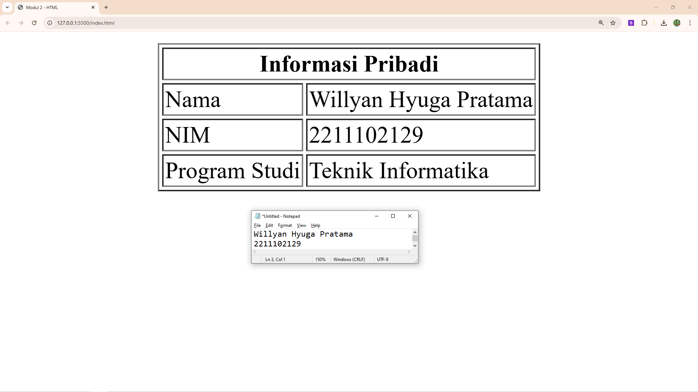

<div align="center">
  <br />
  <h1>LAPORAN PRAKTIKUM <br> APLIKASI BERBASIS PLATFORM </h1>
  <br />
  <h3>MODUL 2 <br> HTML </h3>
  <br />
  
  <br />
  <br />
  <br />
  <h3>Disusun Oleh :</h3>
  <p>
    <strong>Willyan Hyuga Pratama</strong>
    <br>
    <strong>2211102129</strong>
    <br>
    <strong>S1 IF-11-REG05</strong>
  </p>
  <br />
  <h3>Dosen Pengampu :</h3>
  <p>
    <strong>Dedi Agung Prabowo, S.Kom., M.Kom</strong>
  </p>
  <br />
  <br />
  <h4>Asisten Praktikum :</h4>
  <strong>Apri Pandu Wicaksono </strong>
  <br>
  <strong>Hamka Zaenul Ardi</strong>
  <br />
  <h3>LABORATORIUM HIGH PERFORMANCE <br>FAKULTAS INFORMATIKA <br>UNIVERSITAS TELKOM PURWOKERTO <br>2026 </h3>
</div>

<hr>

## Dasar Teori

HTML (HyperText Markup Language) merupakan bahasa markah (markup language) yang digunakan untuk menyusun dan menampilkan struktur konten pada halaman web. HTML menjadi fondasi utama dalam pengembangan web karena berfungsi untuk mendefinisikan elemen-elemen seperti teks, gambar, tautan, tabel, dan berbagai komponen lainnya yang ditampilkan melalui peramban (web browser). Standar HTML dikembangkan dan dikelola oleh World Wide Web Consortium sebagai bagian dari upaya menjaga konsistensi dan interoperabilitas teknologi web.

Secara konseptual, HTML bekerja dengan menggunakan elemen dan tag untuk menandai bagian-bagian tertentu dari sebuah dokumen. Setiap elemen HTML umumnya terdiri dari tag pembuka dan tag penutup yang mengapit konten, serta dapat memiliki atribut yang memberikan informasi tambahan mengenai elemen tersebut. Struktur dokumen HTML disusun secara hierarkis dalam bentuk pohon yang dikenal sebagai Document Object Model (DOM), yang memungkinkan manipulasi dan interaksi dinamis melalui bahasa pemrograman seperti JavaScript.

Perkembangan HTML telah mengalami beberapa versi, dengan versi terbaru yaitu HTML5 yang membawa berbagai peningkatan signifikan, seperti dukungan multimedia (audio dan video) tanpa memerlukan plugin tambahan, elemen semantik (misalnya ``<header>``, ``<article>``, dan ``<footer>``), serta peningkatan kemampuan integrasi dengan teknologi lain seperti CSS untuk pengaturan tampilan dan gaya visual. HTML5 juga mendukung pengembangan aplikasi web modern yang responsif dan interaktif.

Dalam implementasinya, HTML tidak bekerja secara mandiri, melainkan berkolaborasi dengan CSS untuk desain visual dan JavaScript untuk interaktivitas. Kombinasi ketiga teknologi ini membentuk dasar dari pengembangan web modern. HTML berperan sebagai struktur utama, CSS sebagai pengatur tampilan, dan JavaScript sebagai pengendali perilaku aplikasi.

Dengan demikian, HTML merupakan komponen esensial dalam ekosistem teknologi web yang memungkinkan penyajian informasi secara terstruktur, mudah diakses, dan kompatibel lintas platform. Peran HTML yang fundamental menjadikannya sebagai salah satu keterampilan dasar yang wajib dikuasai dalam bidang pengembangan web dan teknologi informasi.

## Tugas 2 - Ujian Web Purba

```
<!-- 2211102129
Willyan Hyuga Pratama
S1IF-11-05 -->

<!DOCTYPE html>
<html lang="en">
<head>
    <meta charset="UTF-8">
    <meta name="viewport" content="width=device-width, initial-scale=1.0">
    <title>Modul 2 - HTML</title>
</head>
<body>
    <table border="1" align="center">
        <tr>
            <th colspan="2">Informasi Pribadi</th>
        </tr>
        <tr>
            <td>Nama</td>
            <td>Willyan Hyuga Pratama</td>
        </tr>
        <tr>
            <td>NIM</td>
            <td>2211102129</td>
        </tr>
        <tr>
            <td>Program Studi</td>
            <td>Teknik Informatika</td>
        </tr>
    </table>
</body>
</html>
```

Output:

