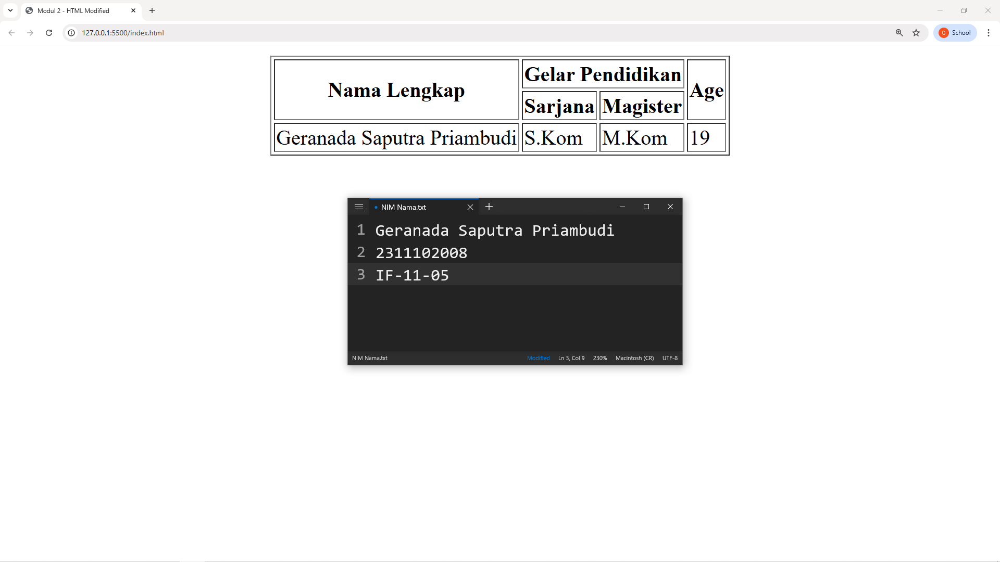

<div align="center">
  <br />
  <h1>LAPORAN PRAKTIKUM <br> APLIKASI BERBASIS PLATFORM </h1>
  <br />
  <h3>MODUL 2 <br> HTML </h3>
  <br />
  
  <br />
  <br />
  <br />
  <h3>Disusun Oleh :</h3>
  <p>
    <strong>Geranada Saputra Priambudi</strong>
    <br>
    <strong>2311102008</strong>
    <br>
    <strong>S1 IF-11-REG05</strong>
  </p>
  <br />
  <h3>Dosen Pengampu :</h3>
  <p>
    <strong>Dedi Agung Prabowo, S.Kom., M.Kom</strong>
  </p>
  <br />
  <br />
  <h4>Asisten Praktikum :</h4>
  <strong>Apri Pandu Wicaksono </strong>
  <br>
  <strong>Hamka Zaenul Ardi</strong>
  <br />
  <h3>LABORATORIUM HIGH PERFORMANCE <br>FAKULTAS INFORMATIKA <br>UNIVERSITAS TELKOM PURWOKERTO <br>2026 </h3>
</div>

<hr>

## Dasar Teori

HTML (HyperText Markup Language) adalah bahasa markup standar yang digunakan untuk membuat dan menyusun struktur halaman web. Dikembangkan pertama kali oleh Tim Berners-Lee pada tahun 1991, HTML berfungsi sebagai kerangka dasar dari setiap halaman web yang dapat diakses melalui browser. HTML bekerja dengan menggunakan tag atau elemen yang membungkus konten untuk mendefinisikan makna dan strukturnya, seperti judul, paragraf, tautan, gambar, dan tabel. Setiap dokumen HTML memiliki struktur dasar yang terdiri dari deklarasi <!DOCTYPE html>, elemen <html> sebagai akar, <head> untuk metadata, dan <body> sebagai wadah konten yang ditampilkan kepada pengguna.
Elemen-elemen dalam HTML bersifat hierarkis dan membentuk struktur pohon yang disebut DOM (Document Object Model). Setiap elemen umumnya terdiri dari opening tag, konten, dan closing tag, misalnya <p>paragraf</p>, meskipun ada pula elemen self-closing seperti  dan <br>. HTML juga mengenal konsep atribut, yaitu informasi tambahan yang ditulis di dalam opening tag untuk mengatur perilaku atau tampilan elemen, seperti href pada tag <a> untuk menentukan tujuan tautan, dan src pada tag  untuk menentukan sumber gambar. Hubungan antar elemen dalam DOM inilah yang kemudian dimanfaatkan oleh CSS untuk mengatur tampilan dan JavaScript untuk memanipulasi konten secara dinamis.
Versi terkini HTML, yaitu HTML5, membawa banyak peningkatan signifikan dibandingkan versi sebelumnya, termasuk penambahan elemen semantik seperti <header>, <footer>, <article>, dan <section> yang membuat struktur dokumen lebih bermakna dan mudah dipahami oleh mesin pencari maupun pembaca layar. HTML5 juga memperkenalkan dukungan native untuk multimedia melalui elemen <audio> dan <video>, serta API bawaan seperti Canvas, Geolocation, dan Local Storage yang memperluas kemampuan aplikasi web tanpa bergantung pada plugin pihak ketiga. Dalam ekosistem pengembangan web modern, HTML selalu berkolaborasi bersama CSS sebagai pengatur tampilan dan JavaScript sebagai pengatur logika interaksi, membentuk tiga pilar utama (trio) yang menjadi fondasi dari setiap aplikasi web yang ada saat ini.

## Tugas 2 - Ujian Web Purba

```
<!DOCTYPE html>
<html lang="en">
<head>
    <meta charset="UTF-8">
    <meta name="viewport" content="width=device-width, initial-scale=1.0">
    <title>Modul 2 - HTML Modified</title>
</head>
<body>
     <table border="1" align="center">
        <tr>
            <th rowspan="2">Nama Lengkap</th>
            <th colspan="2">Gelar Pendidikan</th>
            <th rowspan="2">Age</th>
        </tr>
        <tr>
            <th>Sarjana</th>
            <th>Magister</th>
        </tr>
        <tr>
            <td>Geranada Saputra Priambudi</td>
            <td>S.Kom</td>
            <td>M.Kom</td>
            <td>19</td>
        </tr>
    </table>
</body>
</html>
```

Output:

