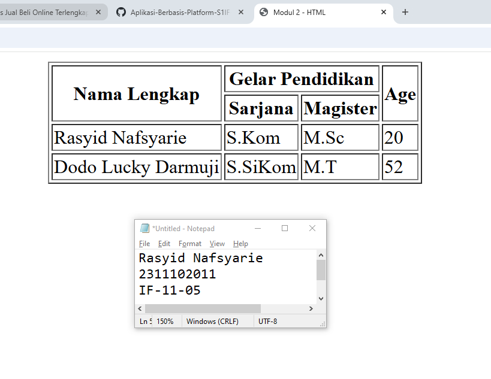

<div align="center">
  <br />
  <h1>LAPORAN PRAKTIKUM <br> APLIKASI BERBASIS PLATFORM </h1>
  <br />
  <h3>MODUL 2 <br> HTML </h3>
  <br />
  
  <br />
  <br />
  <br />
  <h3>Disusun Oleh :</h3>
  <p>
    <strong>Rasyid Nafsyarie</strong>
    <br>
    <strong>2311102011</strong>
    <br>
    <strong>S1 IF-11-REG05</strong>
  </p>
  <br />
  <h3>Dosen Pengampu :</h3>
  <p>
    <strong>Dedi Agung Prabowo, S.Kom., M.Kom</strong>
  </p>
  <br />
  <br />
  <h4>Asisten Praktikum :</h4>
  <strong>Apri Pandu Wicaksono </strong>
  <br>
  <strong>Hamka Zaenul Ardi</strong>
  <br />
  <h3>LABORATORIUM HIGH PERFORMANCE <br>FAKULTAS INFORMATIKA <br>UNIVERSITAS TELKOM PURWOKERTO <br>2026 </h3>
</div>

<hr>

## Dasar Teori

HTML merupakan singkatan dari HyperText Markup Language, yaitu bahasa markup yang digunakan untuk membuat dan menyusun struktur halaman web. HTML berfungsi untuk menampilkan berbagai elemen pada halaman web seperti teks, gambar, tabel, formulir, dan multimedia.

HTML bukan merupakan bahasa pemrograman, melainkan bahasa markup yang menggunakan tag untuk memberi struktur pada konten halaman web.

HTML menjadi standar utama dalam pengembangan web yang diatur oleh World Wide Web Consortium dan WHATWG.

HTML pertama kali dikembangkan pada tahun 1991 oleh Tim Berners-Lee ketika bekerja di CERN.

Tujuan awal pengembangan HTML adalah untuk memudahkan para peneliti dalam berbagi dokumen melalui jaringan internet.

Seiring perkembangan teknologi web, HTML terus mengalami pembaruan hingga versi terbaru yaitu HTML5, yang mendukung berbagai fitur modern seperti multimedia, grafik, dan penyimpanan data lokal.

## Tugas 2 - Ujian Web Purba

```
<!-- 2311102011
Rasyid Nafsyarie
S1IF-11-05 -->

<!DOCTYPE html>
<html lang="en">
<head>
    <meta charset="UTF-8">
    <meta name="viewport" content="width=device-width, initial-scale=1.0">
    <title>Modul 2 - HTML</title>
</head>
<body>
    <table border="1" align="center">
        <tr>
            <th rowspan="2">Nama Lengkap</th>
            <th colspan="2">Gelar Pendidikan</th>
            <th rowspan="2">Age</th>
        </tr>
        <tr>
            <th>Sarjana</th>
            <th>Magister</th>
        </tr>
        <tr>
            <td>Rasyid Nafsyarie</td>
            <td>S.Kom</td>
            <td>M.Sc</td>
            <td>20</td>
        </tr>
        <tr>
            <td>Dodo Lucky Darmuji</td>
            <td>S.SiKom</td>
            <td>M.T</td>
            <td>52</td>
        </tr>
    </table>
</body>
</html>
```

Output:

