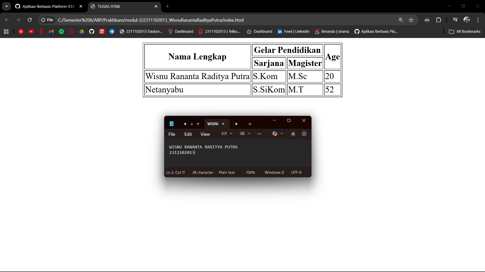

<div align="center">
  <br />
  <h1>LAPORAN PRAKTIKUM <br> APLIKASI BERBASIS PLATFORM </h1>
  <br />
  <h3>MODUL 2 <br> HTML </h3>
  <br />
  
  <br />
  <br />
  <br />
  <h3>Disusun Oleh :</h3>
  <p>
    <strong>Wisnu Rananta Raditya Putra</strong>
    <br>
    <strong>2311102013</strong>
    <br>
    <strong>S1 IF-11-REG05</strong>
  </p>
  <br />
  <h3>Dosen Pengampu :</h3>
  <p>
    <strong>Dedi Agung Prabowo, S.Kom., M.Kom</strong>
  </p>
  <br />
  <br />
  <h4>Asisten Praktikum :</h4>
  <strong>Apri Pandu Wicaksono </strong>
  <br>
  <strong>Hamka Zaenul Ardi</strong>
  <br />
  <h3>LABORATORIUM HIGH PERFORMANCE <br>FAKULTAS INFORMATIKA <br>UNIVERSITAS TELKOM PURWOKERTO <br>2026 </h3>
</div>

<hr>

## Dasar Teori

<p align="justify">
    HTML (HyperText Markup Language) adalah bahasa markup standar yang digunakan untuk membuat dan menyusun struktur halaman web. HTML berfungsi untuk menentukan elemen-elemen pada halaman seperti teks, gambar, tautan, tabel, dan formulir. HTML pertama kali dikembangkan oleh Tim Berners-Lee sebagai bagian dari pengembangan World Wide Web.
</p>

<p align="justify">
    HTML menggunakan struktur berupa tag atau elemen, seperti <html>, <head>, <body>, <p>, dan <a>, yang masing-masing memiliki fungsi tertentu dalam membangun halaman web. Setiap elemen dapat memiliki atribut untuk memberikan informasi tambahan, seperti id, class, atau href. Dalam penggunaannya, HTML sering dikombinasikan dengan bahasa lain seperti CSS untuk mengatur tampilan dan JavaScript untuk menambahkan interaktivitas.
</p>

<p align="justify">
    Dengan HTML, pengembang dapat membuat struktur dasar halaman web yang kemudian dapat ditampilkan melalui browser, sehingga menjadi fondasi utama dalam pengembangan website.
</p>
## Tugas 2 - Ujian Web Purba

```
<!-- 2311102013
Wisnu Rananta Raditya Putra
S1IF-11-05 -->

<!DOCTYPE html>
<html lang="en">
<head>
    <meta charset="UTF-8">
    <meta name="viewport" content="width=device-width, initial-scale=1.0">
    <title>TUGAS HTML</title>
</head>
<body>
    <table border="1" align="center">
        <tr>
            <th rowspan="2">Nama Lengkap</th>
            <th colspan="2">Gelar Pendidikan</th>
            <th rowspan="2">Age</th>
        </tr>
        <tr>
            <th>Sarjana</th>
            <th>Magister</th>
        </tr>
        <tr>
            <td>Wisnu Rananta Raditya Putra</td>
            <td>S.Kom</td>
            <td>M.Kom</td>
            <td>20</td>
        </tr>
        <tr>
            <td>Netanyabu</td>
            <td>S.SiKom</td>
            <td>M.T</td>
            <td>52</td>
        </tr>
    </table>
</body>
</html>
```

Output:

