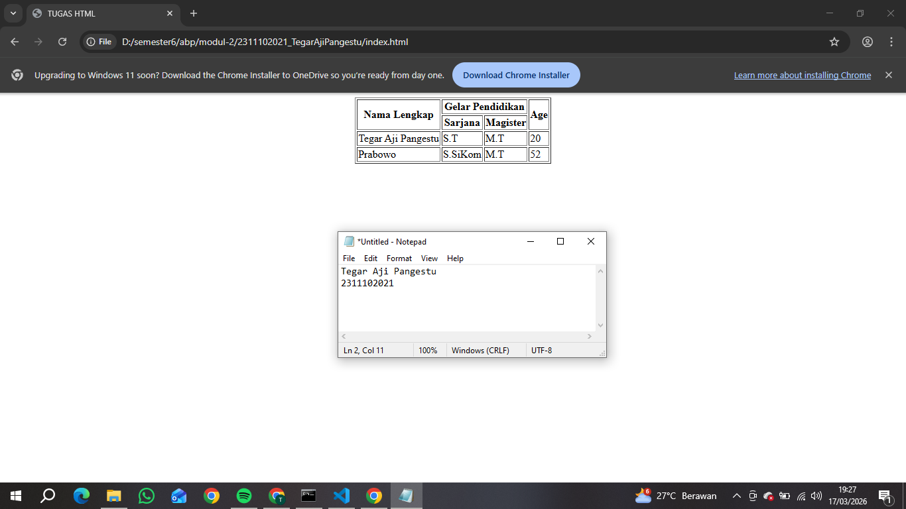

<div align="center">
  <br />
  <h1>LAPORAN PRAKTIKUM <br> APLIKASI BERBASIS PLATFORM </h1>
  <br />
  <h3>MODUL 2 <br> HTML </h3>
  <br />
  
  <br />
  <br />
  <br />
  <h3>Disusun Oleh :</h3>
  <p>
    <strong>Tegar Aji Pangestu</strong>
    <br>
    <strong>2311102021</strong>
    <br>
    <strong>S1 IF-11-REG05</strong>
  </p>
  <br />
  <h3>Dosen Pengampu :</h3>
  <p>
    <strong>Dedi Agung Prabowo, S.Kom., M.Kom</strong>
  </p>
  <br />
  <br />
  <h4>Asisten Praktikum :</h4>
  <strong>Apri Pandu Wicaksono </strong>
  <br>
  <strong>Hamka Zaenul Ardi</strong>
  <br />
  <h3>LABORATORIUM HIGH PERFORMANCE <br>FAKULTAS INFORMATIKA <br>UNIVERSITAS TELKOM PURWOKERTO <br>2026 </h3>
</div>

<hr>

# Dasar Teori

HTML (HyperText Markup Language) adalah bahasa markup standar yang digunakan untuk membuat dan menyusun halaman web di internet. HTML berfungsi sebagai kerangka dasar (struktur) dari sebuah website dengan cara mengatur berbagai elemen seperti judul, paragraf, gambar, tautan (link), tabel, formulir, dan multimedia agar dapat ditampilkan dengan baik di browser seperti Chrome atau Firefox. HTML menggunakan kumpulan tag atau penanda khusus untuk memberi instruksi kepada browser tentang bagaimana konten harus ditampilkan.

Selain itu, HTML juga memungkinkan pengembang untuk menghubungkan satu halaman dengan halaman lain melalui hyperlink, sehingga membentuk jaringan informasi yang luas di internet. Dalam perkembangannya, HTML terus mengalami pembaruan, dan versi terbaru yaitu HTML5 mendukung berbagai fitur modern seperti audio, video, dan elemen grafis tanpa memerlukan plugin tambahan. HTML biasanya tidak bekerja sendiri, melainkan dikombinasikan dengan CSS (Cascading Style Sheets) untuk mengatur tampilan dan desain, serta JavaScript untuk menambahkan interaktivitas, sehingga menghasilkan halaman web yang lebih menarik, responsif, dan dinamis.

# Tugas 2 Ujian web purba
```
<!-- 2311102021
Tegar Aji Pangestu
S1IF-11-05 -->

<!DOCTYPE html>
<html lang="en">
<head>
    <meta charset="UTF-8">
    <meta name="viewport" content="width=device-width, initial-scale=1.0">
    <title>TUGAS HTML</title>
</head>
<body>
    <table border="1" align="center">
        <tr>
            <th rowspan="2">Nama Lengkap</th>
            <th colspan="2">Gelar Pendidikan</th>
            <th rowspan="2">Age</th>
        </tr>
        <tr>
            <th>Sarjana</th>
            <th>Magister</th>
        </tr>
        <tr>
            <td>Tegar Aji Pangestu</td>
            <td>S.T</td>
            <td>M.T</td>
            <td>20</td>
        </tr>
        <tr>
            <td>Prabowo</td>
            <td>S.SiKom</td>
            <td>M.T</td>
            <td>52</td>
        </tr>
    </table>
</body>
</html>
```
Output:

