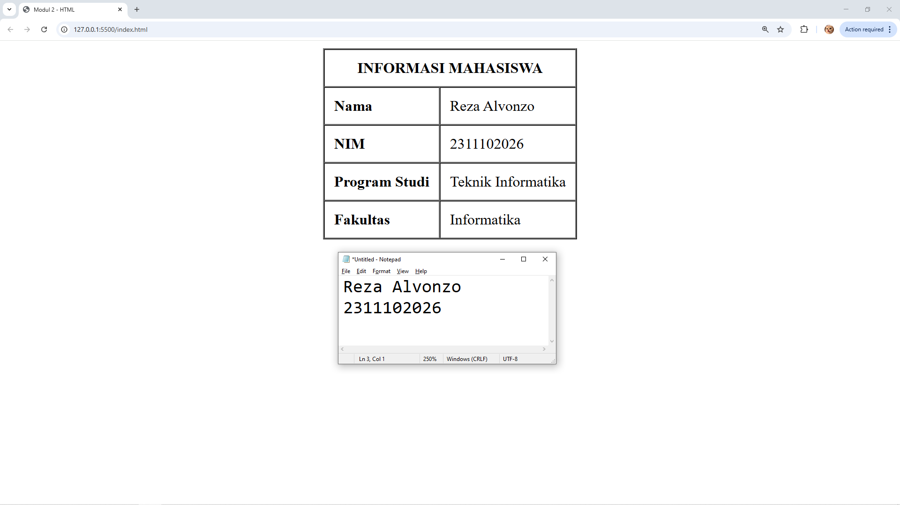

<div align="center">
  <br />
  <h1>LAPORAN PRAKTIKUM <br> APLIKASI BERBASIS PLATFORM </h1>
  <br />
  <h3>MODUL 2 <br> HTML </h3>
  <br />
  
  <br />
  <br />
  <br />
  <h3>Disusun Oleh :</h3>
  <p>
    <strong>Reza Alvonzo</strong>
    <br>
    <strong>2311102026</strong>
    <br>
    <strong>S1 IF-11-REG05</strong>
  </p>
  <br />
  <h3>Dosen Pengampu :</h3>
  <p>
    <strong>Dedi Agung Prabowo, S.Kom., M.Kom</strong>
  </p>
  <br />
  <br />
  <h4>Asisten Praktikum :</h4>
  <strong>Apri Pandu Wicaksono </strong>
  <br>
  <strong>Hamka Zaenul Ardi</strong>
  <br />
  <h3>LABORATORIUM HIGH PERFORMANCE <br>FAKULTAS INFORMATIKA <br>UNIVERSITAS TELKOM PURWOKERTO <br>2026 </h3>
</div>

<hr>

## Dasar Teori

## 1. Definisi dan Filosofi HTML
HyperText Markup Language (HTML) adalah bahasa markah standar yang digunakan untuk menyusun struktur semantik dan presentasi konten pada halaman web. Menurut World Wide Web Consortium (W3C), HTML bukanlah bahasa pemrograman (programming language) karena tidak memiliki logika kondisional atau struktur iterasi, melainkan sebuah bahasa deklaratif yang menggunakan "tag" untuk memberikan instruksi kepada peramban (browser) mengenai cara merender informasi.

Konsep HyperText merujuk pada teks yang mengandung tautan (link) ke teks lain, sementara Markup merujuk pada notasi yang digunakan untuk menandai bagian-bagian dokumen agar mesin dapat memahami perannya (misalnya sebagai judul, paragraf, atau tabel).

## 2. Anatomi dan Struktur Elemen HTML
Setiap dokumen HTML dibangun dari unit terkecil yang disebut elemen. Elemen umumnya terdiri dari tiga komponen utama:

Tag Pembuka (Start Tag): Menandakan awal dari sebuah elemen (contoh: ``<table>``).

Konten: Data atau informasi yang dibungkus oleh elemen tersebut.

Tag Penutup (End Tag): Menandakan akhir elemen (contoh: ``</table>``).

Elemen juga dapat memiliki Atribut, yaitu informasi tambahan yang diletakkan di dalam tag pembuka untuk memodifikasi perilaku atau tampilan elemen, seperti atribut border, align, atau bgcolor pada elemen tabel.

## 3. Struktur Dokumen Standar
Berdasarkan spesifikasi HTML5, setiap berkas HTML harus memiliki struktur dasar yang mencakup:

``<!DOCTYPE html>``: Deklarasi untuk memberitahu browser bahwa dokumen ini menggunakan standar HTML5.

``<html>``: Akar (root) dari seluruh dokumen.

``<head>``: Bagian metadata yang tidak ditampilkan langsung di layar, seperti judul halaman (``<title>``) dan karakter set (utf-8).

``<body>``: Bagian utama yang berisi seluruh konten visual yang akan berinteraksi langsung dengan pengguna.

## 4. Implementasi Tabel dalam HTML
Elemen tabel (``<table>``) digunakan untuk menyajikan data dalam format tabular (baris dan kolom). Dalam konteks akademik dan pengembangan web, tabel HTML diatur melalui hirarki tag berikut:

``<tr>`` (Table Row): Mendefinisikan baris dalam tabel.

``<th>`` (Table Header): Mendefinisikan sel tajuk yang secara default dicetak tebal dan rata tengah.

``<td>`` (Table Data): Mendefinisikan sel data standar dalam tabel.

Penggunaan atribut colspan dan rowspan sering diterapkan dalam desain tabel untuk melakukan penggabungan sel (cell merging), yang berfungsi meningkatkan keterbacaan data yang kompleks.

## 5. Evolusi HTML dan Web Semantik
Seiring perkembangan teknologi web, HTML telah berevolusi dari sekadar alat pemformatan teks menjadi fondasi web semantik. HTML5 memperkenalkan elemen yang lebih bermakna seperti ``<header>``, ``<footer>``, dan ``<article>``. Meskipun tampilan visual saat ini lebih banyak dikelola oleh CSS, pemahaman mendalam mengenai struktur HTML tetap menjadi fundamental bagi seorang Full-Stack Developer untuk memastikan aksesibilitas (accessibility) dan optimasi mesin pencari (SEO).

## Tugas 2 - Ujian Web Purba

```
<!DOCTYPE html>
<html lang="en">
<head>
    <meta charset="UTF-8">
    <meta name="viewport" content="width=device-width, initial-scale=1.0">
    <title>Modul 2 - HTML</title>
</head>
<body>
    <table border="1" align="center"  cellpadding="10" cellspacing="0">
        <tr>
            <th colspan="2">INFORMASI MAHASISWA</th>
        </tr>
        <tr>
            <td ><b>Nama</b></td>
            <td>Reza Alvonzo</td>
        </tr>
        <tr>
            <td><b>NIM</b></td>
            <td>2311102026</td>
        </tr>
        <tr>
            <td ><b>Program Studi</b></td>
            <td>Teknik Informatika</td>
        </tr>
        <tr>
            <td ><b>Fakultas</b></td>
            <td>Informatika</td>
        </tr>
    </table>
</body>
</html>
```

Output:

