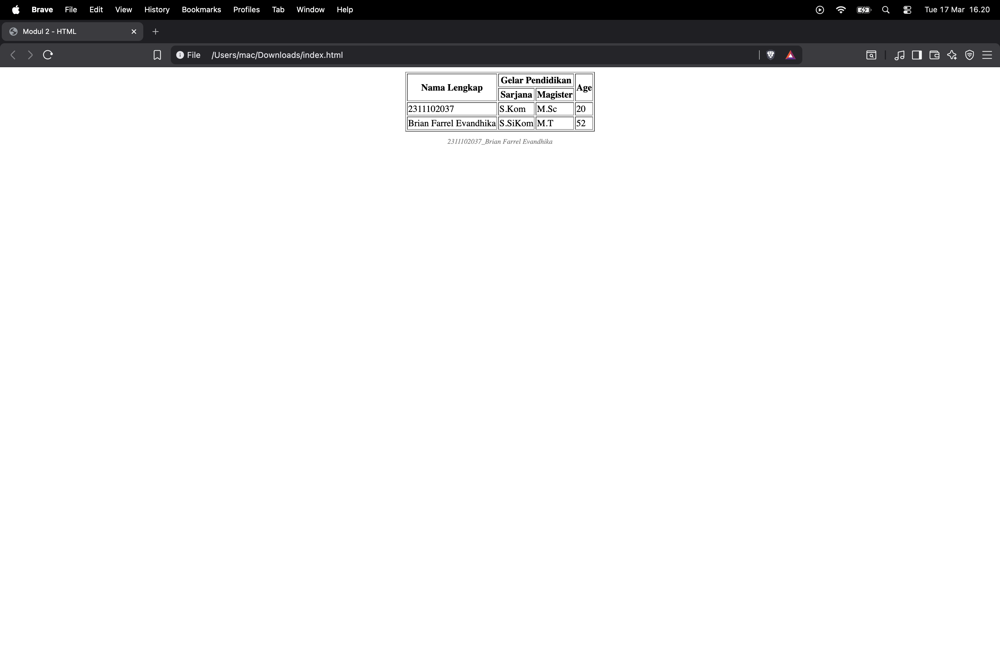

<div align="center">
  <br />
  <h1>LAPORAN PRAKTIKUM <br> APLIKASI BERBASIS PLATFORM </h1>
  <br />
  <h3>MODUL 2 <br> HTML </h3>
  <br />
  
  <br />
  <br />
  <br />
  <h3>Disusun Oleh :</h3>
  <p>
    <strong>Brian Farrel Evandhika</strong>
    <br>
    <strong>2311102037</strong>
    <br>
    <strong>S1 IF-11-REG05</strong>
  </p>
  <br />
  <h3>Dosen Pengampu :</h3>
  <p>
    <strong>Dedi Agung Prabowo, S.Kom., M.Kom</strong>
  </p>
  <br />
  <br />
  <h4>Asisten Praktikum :</h4>
  <strong>Apri Pandu Wicaksono </strong>
  <br>
  <strong>Hamka Zaenul Ardi</strong>
  <br />
  <h3>LABORATORIUM HIGH PERFORMANCE <br>FAKULTAS INFORMATIKA <br>UNIVERSITAS TELKOM PURWOKERTO <br>2026 </h3>
</div>

<hr>

## Dasar Teori

HTML (HyperText Markup Language) merupakan bahasa markup standar yang digunakan untuk membangun struktur dasar halaman web melalui sistem tag, bukan sebagai bahasa pemrograman. Sejak diperkenalkan oleh Tim Berners-Lee pada tahun 1991 untuk mempermudah pertukaran dokumen antar peneliti di CERN, HTML terus berkembang di bawah pengawasan W3C dan WHATWG. Kini, melalui versi terbarunya yaitu HTML5, bahasa ini telah mendukung berbagai fitur modern seperti pengolahan multimedia dan grafik, yang memungkinkan tampilan teks, gambar, hingga formulir di internet menjadi lebih interaktif dan terorganisir.

## Tugas 2 - Ujian Web Purba

```
<!DOCTYPE html>
<html lang="en">
<head>
    <meta charset="UTF-8">
    <meta name="viewport" content="width=device-width, initial-scale=1.0">
    <title>Modul 2 - HTML</title>
    <style>
        .watermark {
            text-align: center;
            font-size: 12px;
            color: gray;
            margin-top: 10px;
            font-style: italic;
        }
    </style>
</head>
<body>

    <table border="1" align="center">
        <tr>
            <th rowspan="2">Nama Lengkap</th>
            <th colspan="2">Gelar Pendidikan</th>
            <th rowspan="2">Age</th>
        </tr>
        <tr>
            <th>Sarjana</th>
            <th>Magister</th>
        </tr>
        <tr>
            <td>2311102037</td>
            <td>S.Kom</td>
            <td>M.Sc</td>
            <td>20</td>
        </tr>
        <tr>
            <td>Brian Farrel Evandhika</td>
            <td>S.SiKom</td>
            <td>M.T</td>
            <td>52</td>
        </tr>
    </table>

    <div class="watermark">
        2311102037_Brian Farrel Evandhika
    </div>

</body>
</html>
```


## **Screenshot Program**



