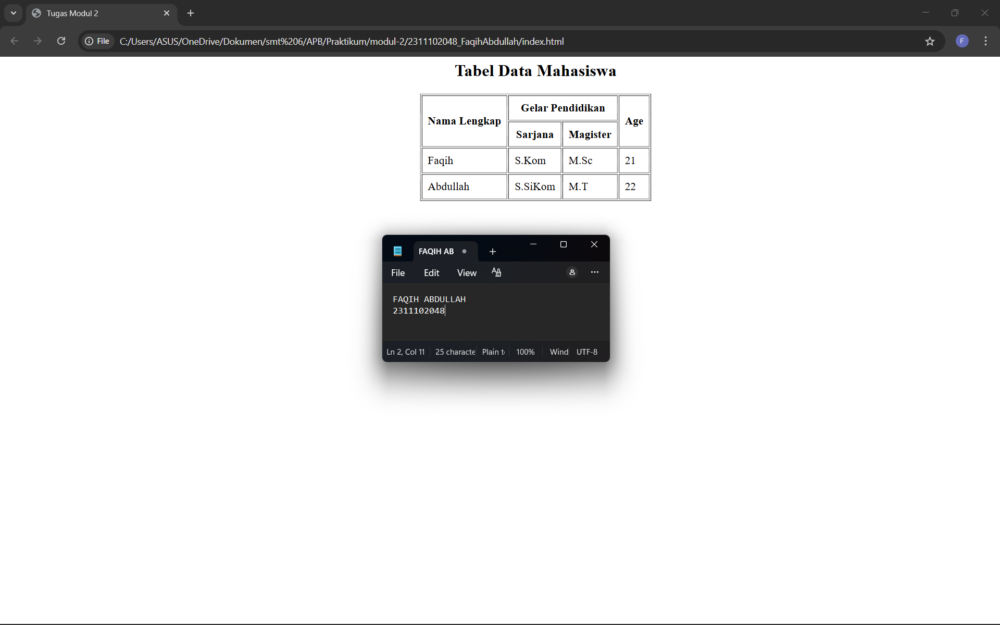

<div align="center">

# LAPORAN PRAKTIKUM  
## APLIKASI BERBASIS PLATFORM  

### MODUL 2
### html

<br>


<br><br>

### Disusun Oleh

**Faqih Abdullah**  
**2311102048**  
**S1 IF-11-REG05**

<br>

### Dosen Pengampu
Dedi Agung Prabowo, S.Kom., M.Kom

<br>

### Asisten Praktikum
Apri Pandu Wicaksono  
Hamka Zaenul Ardi

<br><br>

**LABORATORIUM HIGH PERFORMANCE**  
**FAKULTAS INFORMATIKA**  
**UNIVERSITAS TELKOM PURWOKERTO**  

2026

</div>

---

# Modul 2 – Dasar Tabel HTML

## Dasar Teori

HTML (HyperText Markup Language) merupakan bahasa markup yang digunakan untuk membuat struktur halaman web. HTML terdiri dari berbagai elemen atau tag yang digunakan untuk menampilkan teks, gambar, tabel, formulir, dan berbagai komponen lainnya pada halaman web.

Salah satu elemen penting dalam HTML adalah **tabel**. Tabel digunakan untuk menampilkan data dalam bentuk baris dan kolom sehingga informasi dapat disajikan dengan lebih terstruktur dan mudah dibaca.

Elemen utama dalam pembuatan tabel pada HTML antara lain:

* `<table>` : digunakan untuk mendefinisikan tabel.
* `<tr>` : (table row) digunakan untuk membuat baris pada tabel.
* `<th>` : (table header) digunakan untuk membuat judul kolom pada tabel.
* `<td>` : (table data) digunakan untuk menampilkan isi data pada tabel.

Selain itu, HTML juga menyediakan atribut seperti **rowspan** dan **colspan** yang digunakan untuk menggabungkan beberapa baris atau kolom dalam satu sel tabel.

Pada HTML versi lama, pengaturan posisi elemen pada halaman web dapat dilakukan menggunakan tag `<center>`. Tag ini digunakan untuk menempatkan elemen agar berada di tengah secara horizontal pada halaman web. Meskipun pada perkembangan web modern pengaturan tata letak biasanya dilakukan menggunakan CSS, penggunaan tag ini masih dapat digunakan untuk memahami konsep dasar pengaturan posisi elemen dalam HTML.

Pada praktikum modul ini, dibuat sebuah tabel sederhana yang menampilkan data dengan memanfaatkan elemen-elemen tabel HTML. Tabel tersebut ditempatkan di tengah halaman menggunakan tag `<center>` tanpa menggunakan CSS atau styling tambahan.


## Source Code

```html
<!DOCTYPE html>
<html>
<head>
    <title>Tugas Modul 2</title>
</head>
<body>

<center>

<h2>Tabel Data Mahasiswa</h2>

<table border="1">
<tr>
    <th rowspan="2">Nama Lengkap</th>
    <th colspan="2">Gelar Pendidikan</th>
    <th rowspan="2">Age</th>
</tr>
<tr>
    <th>Sarjana</th>
    <th>Magister</th>
</tr>
<tr>
    <td>Budi</td>
    <td>S.Kom</td>
    <td>M.Sc</td>
    <td>35</td>
</tr>
<tr>
    <td>Andi</td>
    <td>S.SiKom</td>
    <td>M.T</td>
    <td>52</td>
</tr>

</table>

</center>

</body>
</html>
```

--
## hasil Praktikum



