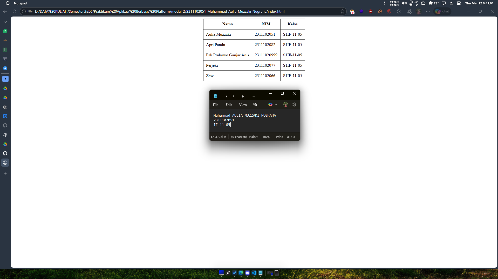

<div align="center">
  <br />
  <h1>LAPORAN PRAKTIKUM <br> APLIKASI BERBASIS PLATFORM </h1>
  <br />
  <h3>MODUL 2 <br> HTML </h3>
  <br />
  
  <br />
  <br />
  <br />
  <h3>Disusun Oleh :</h3>
  <p>
    <strong>Muhammad Aulia Muzzaki Nugraha</strong>
    <br>
    <strong>2311102051</strong>
    <br>
    <strong>S1 IF-11-REG05</strong>
  </p>
  <br />
  <h3>Dosen Pengampu :</h3>
  <p>
    <strong>Dedi Agung Prabowo, S.Kom., M.Kom</strong>
  </p>
  <br />
  <br />
  <h4>Asisten Praktikum :</h4>
  <strong>Apri Pandu Wicaksono </strong>
  <br>
  <strong>Hamka Zaenul Ardi</strong>
  <br />
  <h3>LABORATORIUM HIGH PERFORMANCE <br>FAKULTAS INFORMATIKA <br>UNIVERSITAS TELKOM PURWOKERTO <br>2026 </h3>
</div>

<hr>

## Dasar Teori

HTML (HyperText Markup Language) adalah bahasa markup standar yang digunakan untuk membuat dan menyusun struktur halaman web. HTML berfungsi untuk menentukan elemen-elemen yang ada pada halaman web seperti teks, gambar, tautan (link), tabel, formulir, dan berbagai komponen lainnya yang ditampilkan di browser.

HTML bukan merupakan bahasa pemrograman, melainkan bahasa markup yang menggunakan tag untuk menandai bagian-bagian tertentu dari dokumen sehingga dapat dipahami oleh browser.

### Sejarah Singkat HTML

HTML pertama kali dikembangkan oleh Tim Berners-Lee pada tahun 1991 sebagai bagian dari proyek World Wide Web. Seiring perkembangan teknologi web, HTML mengalami berbagai pembaruan hingga saat ini versi yang paling banyak digunakan adalah HTML5, yang mendukung multimedia seperti audio, video, dan grafis tanpa memerlukan plugin tambahan.

### Struktur Dasar Dokumen HTML

Sebuah dokumen HTML modern umumnya diawali dengan deklarasi `<!DOCTYPE html>` untuk memberi tahu browser bahwa dokumen menggunakan standar HTML5. Setelah itu terdapat elemen utama `<html>`, yang di dalamnya terbagi menjadi dua bagian besar, yaitu `<head>` dan `<body>`.

Bagian `<head>` berisi metadata halaman seperti pengaturan karakter (`<meta charset="UTF-8">`), pengaturan viewport agar responsif di perangkat mobile, judul halaman (`<title>`), dan informasi lain yang tidak langsung ditampilkan pada isi halaman. Sementara itu, bagian `<body>` berisi seluruh konten yang terlihat oleh pengguna, seperti teks, tabel, gambar, formulir, dan tautan.

### Konsep Tag, Elemen, dan Atribut

Dalam HTML, komponen dasar disebut elemen. Elemen biasanya ditulis dengan tag pembuka dan tag penutup, misalnya `<p>...</p>` untuk paragraf atau `<h1>...</h1>` untuk judul. Beberapa elemen juga dapat berdiri sendiri, seperti `` dan `<br>`.

Atribut digunakan untuk memberikan informasi tambahan pada elemen. Contohnya `src` pada `` untuk menentukan sumber gambar, `href` pada `<a>` untuk menentukan tujuan tautan, serta `border`, `cellpadding`, `cellspacing`, dan `align` pada `<table>` untuk mengatur tampilan tabel secara langsung melalui atribut HTML.

### HTML untuk Tabel

Untuk menyajikan data dalam bentuk baris dan kolom, HTML menyediakan elemen tabel seperti `<table>`, `<tr>`, `<th>`, dan `<td>`. Elemen `<table>` adalah wadah utama tabel, `<tr>` membentuk baris, `<th>` membentuk sel header, dan `<td>` membentuk sel data biasa.

Pada tugas ini, tabel diminta berada di tengah tanpa CSS. Secara historis, HTML lama menyediakan atribut `align="center"` pada `<table>` untuk memusatkan tabel secara horizontal. Atribut `border`, `cellpadding`, dan `cellspacing` juga termasuk pendekatan lama yang dahulu umum dipakai sebelum CSS menjadi standar utama untuk pengaturan tampilan.

### Perkembangan dari HTML Lama ke HTML5

Dalam praktik pengembangan web modern, pengaturan tampilan sebaiknya dipisahkan ke CSS agar struktur (HTML) dan presentasi (CSS) tetap rapi serta mudah dirawat. Namun, mempelajari pendekatan lama tetap penting untuk memahami evolusi web dan mengetahui bagaimana browser lama menampilkan halaman.

Dengan memahami konsep dasar ini, praktikan dapat membedakan fungsi HTML sebagai penyusun struktur konten dan fungsi CSS sebagai pengatur tampilan, sekaligus memahami alasan tugas tertentu masih meminta penggunaan teknik HTML klasik.

## Tugas 2 - Ujian Web Purba

Bikin tampilan table dasar, tapi posisinya wajib persis di tengah layar. Nah, syarat utamanya: HARAM pakai CSS, inline style, atau styling apapun. Coba gali lagi ingatan lu soal tag-tag HTML jadul yang bisa ngakalin ini.

```
<!-- 2311102051
Muhammad Aulia Muzzaki Nugraha
S1IF-11-05 -->

<!DOCTYPE html>
<html lang="en">
<head>
    <meta charset="UTF-8">
    <meta name="viewport" content="width=device-width, initial-scale=1.0">
    <title>Tabel</title>
</head>
<body>
    <table align="center" border="1" cellpadding="10" cellspacing="0">
        <tr>
            <th>Nama</th>
            <th>NIM</th>
            <th>Kelas</th>
        </tr>
        <tr>
            <td>Aulia Muzzaki</td>
            <td>2311102051</td>
            <td>S1IF-11-05</td>
        </tr>
        <tr>
            <td>Apri Pandu</td>
            <td>2311102082</td>
            <td>S1IF-11-05</td>
        </tr>
        <tr>
            <td>Pak Prabowo Ganjar Anis</td>
            <td>23111020999</td>
            <td>S1IF-11-05</td>
        </tr>
        <tr>
            <td>Perjeki</td>
            <td>2311102077</td>
            <td>S1IF-11-05</td>
        </tr>
        <tr>
            <td>Zaw</td>
            <td>2311102066</td>
            <td>S1IF-11-05</td>
        </tr>
    </table>
</body>
</html>
```

Output:

