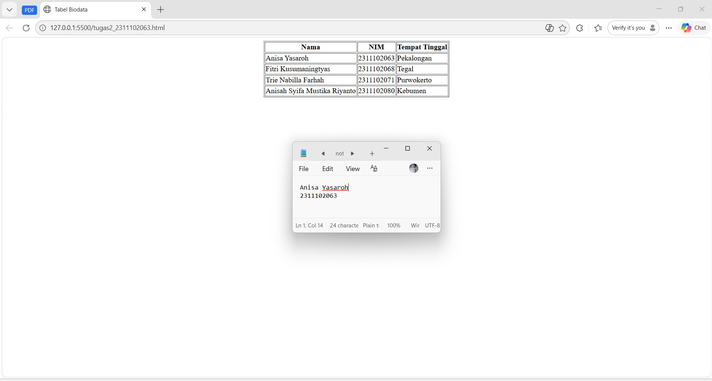

<div align="center">
  <br />
  <h1>LAPORAN PRAKTIKUM <br> APLIKASI BERBASIS PLATFORM </h1>
  <br />
  <h3>MODUL 2 <br> HTML </h3>
  <br />
  
  <br />
  <br />
  <br />
  <h3>Disusun Oleh :</h3>
  <p>
    <strong>Anisa Yasaroh</strong>
    <br>
    <strong>2311102063</strong>
    <br>
    <strong>S1 IF-11-REG05</strong>
  </p>
  <br />
  <h3>Dosen Pengampu :</h3>
  <p>
    <strong>Dedi Agung Prabowo, S.Kom., M.Kom</strong>
  </p>
  <br />
  <br />
  <h4>Asisten Praktikum :</h4>
  <strong>Apri Pandu Wicaksono </strong>
  <br>
  <strong>Hamka Zaenul Ardi</strong>
  <br />
  <h3>LABORATORIUM HIGH PERFORMANCE <br>FAKULTAS INFORMATIKA <br>UNIVERSITAS TELKOM PURWOKERTO <br>2026 </h3>
</div>

<hr>

## 1. Dasar Teori

HTML adalah kependekan dari *Hypertext Markup Language* yang merupakan sebuah bahasa markup. Digunakan untuk menyusun struktur dasar halaman web. HTML berfungsi mengatur elemen-elemen pada website seperti judul, paragraf, gambar, tabel, dan tautan agar dapat ditampilkan dengan baik di browser.

HTML pertama kali dikembangkan oleh Tim Berners-Lee pada tahun 1991 sebagai sarana berbagi dokumen antar peneliti. Saat ini HTML menjadi dasar utama dalam pengembangan website dan sangat cocok dipelajari oleh pemula karena sintaksnya sederhana dan mudah dipahami. File HTML biasanya disimpan dengan ekstensi .html dan berisi kombinasi tag, elemen, serta atribut.

Struktur Dasar HTML
1. Tag adalah penanda dalam HTML yang ditulis dengan tanda < > dan biasanya terdiri dari tag pembuka serta penutup.
Contoh: `<h1>Judul Halaman</h1>`. Tag utama yang digunakan untuk membuat tabel pada HTML adalah `<table>` sebagai pembentuk tabel, `<tr>` untuk membuat baris, `<th>` untuk menampilkan judul kolom, dan `<td>` untuk mengisi data pada setiap sel tabel. Selain tag utama tabel, HTML juga memiliki atribut seperti border untuk garis tabel, cellpadding untuk memberi jarak isi sel, dan cellspacing untuk mengatur jarak antar sel. Pada praktikum dasar, tabel biasanya dibuat sederhana tanpa tambahan CSS. Agar tabel berada di tengah halaman, pada HTML lama dapat digunakan tag `<center>`, yaitu tag yang berfungsi menampilkan elemen di bagian tengah browser.

2. Element
Element adalah gabungan tag pembuka, isi, dan tag penutup.
Contoh:  `<p>Belajar HTML Dasar</p>`

3. Attribute
Attribute merupakan informasi tambahan pada tag HTML yang digunakan untuk mengatur elemen, misalnya pada tag `` atribut src berfungsi menentukan lokasi gambar sedangkan alt menampilkan teks alternatif jika gambar tidak berhasil dimuat.
Contoh: ``

## 2. Penjelasan Kode HTML

Pada modul ini, kode HTML digunakan untuk menyusun sebuah tabel sederhana yang memuat informasi biodata dalam tiga kolom, yaitu Nama, NIM, dan Tempat Tinggal, dengan posisi tabel berada di tengah halaman tanpa tambahan CSS.

### Kode HTML (`tugas2_2311102063.html`)

```html
<!-- 2311102063
Anisa Yasaroh
IF-11-REG05 -->

<!DOCTYPE html>
<html>

<head>
  <title>Tabel Biodata</title>
</head>

<body>

  <center>

    <table border="1">

      <tr>
        <th>Nama</th>
        <th>NIM</th>
        <th>Tempat Tinggal</th>
      </tr>

      <tr>
        <td>Anisa Yasaroh</td>
        <td>2311102063</td>
        <td>Pekalongan</td>
      </tr>

      <tr>
        <td>Fitri Kusumaningtyas</td>
        <td>2311102068</td>
        <td>Tegal</td>
      </tr>

      <tr>
        <td>Trie Nabilla Farhah</td>
        <td>2311102071</td>
        <td>Purwokerto</td>
      </tr>

      <tr>
        <td>Anisah Syifa Mustika Riyanto</td>
        <td>2311102080</td>
        <td>Kebumen</td>
      </tr>

    </table>

  </center

</body>

</html>
```
### Hasil Tampilan (Screenshot)


## Penjelasan Code

Kode diawali dengan tag `<html>` yang berfungsi sebagai pembungkus seluruh isi dokumen HTML. Pada bagian `<head>`, terdapat tag `<title>` yang digunakan untuk memberikan judul halaman, sehingga teks Tabel Biodata akan tampil pada tab browser saat halaman dibuka.

Di dalam bagian `<body>`, tag `<center>` digunakan untuk menempatkan tabel agar tampil di tengah halaman. Selanjutnya, tag `<table border="1">` berfungsi membuat tabel beserta garis tepinya agar setiap data terlihat terpisah dengan jelas. Setiap baris tabel dibuat menggunakan tag `<tr>`, dengan baris pertama berisi tag `<th>` sebagai judul kolom yaitu Nama, NIM, dan Tempat Tinggal. Baris berikutnya menggunakan tag `<td>` untuk mengisi data pada setiap sel, sehingga biodata beberapa mahasiswa dapat ditampilkan secara terstruktur dalam bentuk tabel yang rapi.

Sesuai dengan gambar output, tabel menampilkan empat data mahasiswa yaitu Anisa Yasaroh dengan NIM 2311102063 yang berasal dari Pekalongan, Fitri Kusumantyias dengan NIM 2311102068 dari Tegal, Trie Nabilla Farhah dengan NIM 2311102071 dari Purwokerto, serta Anisah Syifa Mustika Riyanto dengan NIM 2311102080 dari Kebumen. Setiap data ditampilkan dalam baris yang berbeda sehingga informasi tersusun rapi dan mudah dibaca oleh pengguna.


