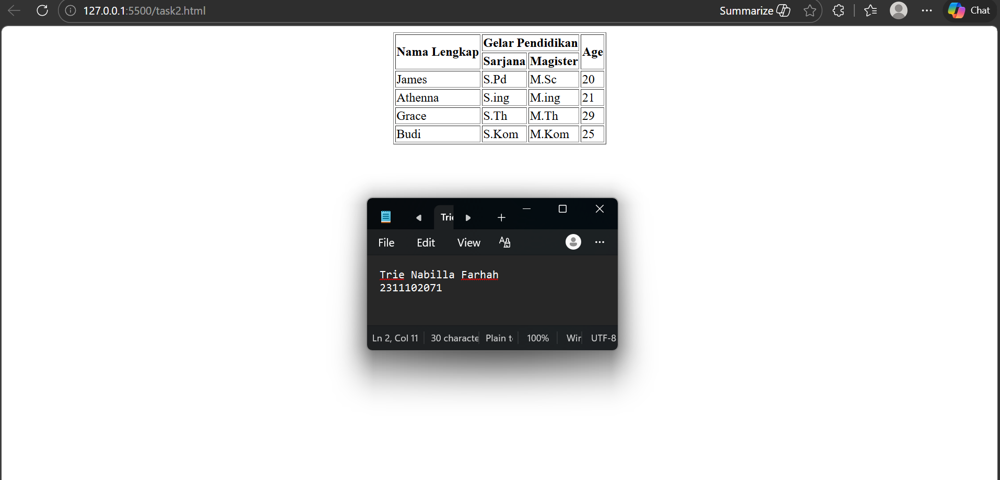

# Modul 2

   
  <h1>LAPORAN PRAKTIKUM   APLIKASI BERBASIS PLATFORM </h1>
   
  <h3>MODUL 2   HTML </h3>
   
  
   
   
   
  <h3>Disusun Oleh :</h3>
  

    <strong>Trie Nabilla Farhah</strong>
     
    <strong>2311102071</strong>
     
    <strong>S1 IF-11-REG05</strong>
  

   
  <h3>Dosen Pengampu :</h3>
  

    <strong>Dedi Agung Prabowo, S.Kom., M.Kom</strong>
  

   
   
  <h4>Asisten Praktikum :</h4>
  <strong>Apri Pandu Wicaksono </strong>
   
  <strong>Hamka Zaenul Ardi</strong>
   
  <h3>LABORATORIUM HIGH PERFORMANCE  FAKULTAS INFORMATIKA  UNIVERSITAS TELKOM PURWOKERTO  2026 </h3>

## 1. Dasar Teori

HTML merupakan singkatan dari **Hypertext Markup Language**. Hypertext adalah dokumen yang memiliki tautan (link) yang memungkinkan pengguna berpindah dari satu halaman ke halaman lainnya dengan mudah. Sementara itu, Markup Language adalah kumpulan kode atau tag yang digunakan untuk memberi tanda pada suatu dokumen agar dapat dipahami oleh komputer dan ditampilkan dengan struktur tertentu. Dengan demikian, HTML dapat diartikan sebagai bahasa markup yang digunakan untuk membuat dan menyusun struktur dasar halaman website, seperti menampilkan teks, gambar, tautan, tabel, dan berbagai elemen lainnya agar dapat ditampilkan dengan baik di browser.

HTML pertama kali diperkenalkan oleh Tim Berners-Lee pada akhir tahun 1991 untuk memudahkan pengelolaan dokumen. Seiring perkembangan teknologi, HTML kemudian berkembang menjadi bahasa markup yang digunakan untuk membuat halaman website. Hingga saat ini, versi terbaru yang banyak digunakan adalah HTML5 yang dirilis pada tahun 2014 dan sudah mendukung fitur seperti penyematan video dan audio.

Fungsi HTML
1. Membuat Halaman Website
2. Menampilkan Berbagai Informasi dalam Browser Internet
3. Membuat Link Menuju Halaman Website Lain

Kelebihan dan Kekurangan HTML

Kelebihan
1. Mudah dipelajari dan digunakan: HTML adalah bahasa markup yang relatif sederhana dengan struktur sintaks yang mudah dipahami, sehingga mudah dipelajari oleh pemula.
2. Kompatibel dengan banyak browser: Hampir semua browser mendukung HTML. Artinya ketika anda membuat web HTML, halaman tersebut dapat diakses dan dilihat oleh pengguna di berbagai perangkat dan browser tanpa konfigurasi tambahan.
3. Ringan: HTML bersifat statis, yang membuatnya lebih ringan dibandingkan dengan halaman web dinamis.
4. SEO Friendly: HTML memiliki fungsi tag yang tepat seperti heading, meta description, hingga alt text yang dapat lebih mudah diindeks oleh mesin pencari seperti Google.

Kekurangan
1. Kurang dinamis: HTML adalah bahasa markup dan tidak bisa menjalankan logika pemrograman. Untuk menambahkan fitur dinamis seperti interaksi dengan pengguna, anda harus mengkombinasikan dengan bahasa lain seperti JavaScript atau CSS.
2. Tidak cocok untuk website skala besar: HTML tidak dirancang untuk menangani aplikasi web yang sangat besar dan kompleks. Semakin besar situs web yang dibuat, semakin sulit juga untuk mengelola struktur HTML-nya. Selain itu, HTML tidak dapat terhubung langsung dengan database.

## 2. Penjelasan Kode HTML

Pada modul ini, kode HTML digunakan untuk menyusun sebuah tabel sederhana yang menampilkan data beberapa orang. Tabel tersebut memuat beberapa kolom yaitu Nama Lengkap, Gelar Pendidikan yang terdiri dari Sarjana dan Magister, serta Age. Data yang ditampilkan meliputi James, Athenna, Grace, dan Budi beserta gelar pendidikan dan usia masing-masing, dengan tampilan tabel yang disusun secara sederhana tanpa menggunakan tambahan CSS.

### Kode HTML (`task2.html`)

<!-- 2311102071
Trie Nabilla Farhah
IF-11-REG05 -->

<!doctype html>
<html>

<head>
    <title>Tabel Data Akademik</title>
</head>

<body>
    <table border="1" align="center">
        <tr>
            <th rowspan="2">Nama Lengkap</th>
            <th colspan="2">Gelar Pendidikan</th>
            <th rowspan="2">Age</th>
        </tr>
        <tr>
            <th>Sarjana</th>
            <th>Magister</th>
        </tr>
        <tr>
            <td>James</td>
            <td>S.Pd</td>
            <td>M.Sc</td>
            <td>20</td>
        </tr>
        <tr>
            <td>Athenna</td>
            <td>S.ing</td>
            <td>M.ing</td>
            <td>21</td>
        </tr>
        <tr>
            <td>Grace</td>
            <td>S.Th</td>
            <td>M.Th</td>
            <td>29</td>
        </tr>
        <tr>
            <td>Budi</td>
            <td>S.Kom</td>
            <td>M.Kom</td>
            <td>25</td>
        </tr>
    </table>
</body>

</html>

### Hasil Tampilan (Screenshot)

## Penjelasan Code

Kode HTML tersebut digunakan untuk membuat halaman web sederhana yang menampilkan **tabel data akademik**. Struktur halaman diawali dengan deklarasi `<!doctype html>` yang menandakan penggunaan HTML5, kemudian tag `<html>`, `<head>`, dan `<body>` yang menyusun kerangka dasar halaman. Pada bagian `<head>` terdapat tag `<title>` yang menampilkan judul halaman **“Tabel Data Akademik”** pada tab browser.

Di dalam `<body>` dibuat sebuah tabel menggunakan tag `<table>` dengan atribut `border="1"` untuk menampilkan garis tabel dan `align="center"` agar tabel berada di tengah halaman. Struktur tabel terdiri dari `<tr>` sebagai baris, `<th>` sebagai header atau judul kolom, dan `<td>` sebagai isi data tabel.

Pada bagian header digunakan atribut `rowspan` dan `colspan` untuk menggabungkan sel, di mana kolom **Nama Lengkap** dan **Age** memanjang ke dua baris, sedangkan **Gelar Pendidikan** dibagi menjadi dua kolom yaitu **Sarjana** dan **Magister**. Tabel kemudian menampilkan beberapa data nama beserta gelar pendidikan dan umur sehingga informasi dapat disajikan dengan rapi dan terstruktur.

