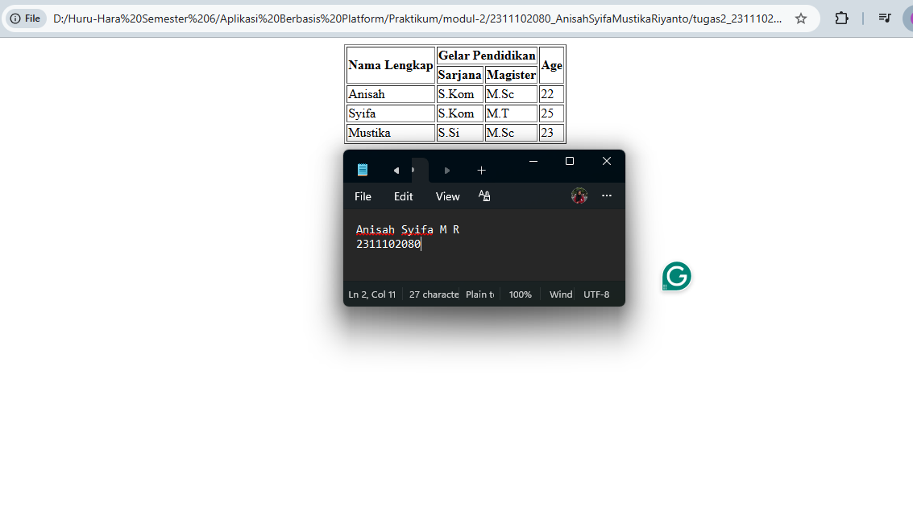

<div align="center">
  <br />
  <h1>LAPORAN PRAKTIKUM <br> APLIKASI BERBASIS PLATFORM </h1>
  <br />
  <h3>MODUL 2 <br> HTML </h3>
  <br />
  
  <br />
  <br />
  <br />
  <h3>Disusun Oleh :</h3>
  <p>
    <strong>Anisah Syifa Mustika Riyanto</strong>
    <br>
    <strong>2311102080</strong>
    <br>
    <strong>S1 IF-11-REG05</strong>
  </p>
  <br />
  <h3>Dosen Pengampu :</h3>
  <p>
    <strong>Dedi Agung Prabowo, S.Kom., M.Kom</strong>
  </p>
  <br />
  <br />
  <h4>Asisten Praktikum :</h4>
  <strong>Apri Pandu Wicaksono </strong>
  <br>
  <strong>Hamka Zaenul Ardi</strong>
  <br />
  <h3>LABORATORIUM HIGH PERFORMANCE <br>FAKULTAS INFORMATIKA <br>UNIVERSITAS TELKOM PURWOKERTO <br>2026 </h3>
</div>

<hr>

## 1. Dasar Teori

**Pengenalan HTML** 

HTML (HyperText Markup Language) adalah bahasa standar yang digunakan untuk membuat dan merancang halaman web. Dalam dunia web development, HTML berfungsi sebagai kerangka dasar yang mendefinisikan struktur dan isi dari sebuah halaman web.

**Apa Itu HTML?**

HTML adalah bahasa markup yang digunakan untuk membuat dan menyusun struktur halaman web. HTML menggunakan elemen dan tag untuk menentukan cara konten diatur dan ditampilkan pada browser.HTML hanya digunakan untuk menentukan struktur dan tata letak konten di halaman web. HTML tidak memiliki kemampuan untuk membuat keputusan logis atau melakukan operasi aritmetika. Ia hanya menyediakan kerangka untuk konten yang akan ditampilkan di browser.

**Struktur Dasar HTML**

Struktur dasar HTML membentuk fondasi dari setiap halaman web. Dengan memahami elemen-elemen inti dan cara menyusunnya, kamu akan dapat membuat halaman web yang terorganisir dan fungsional. HTML menggunakan berbagai tag untuk membuat elemen, seperti judul, paragraf, gambar, dan tautan. Setiap dokumen HTML dimulai dengan deklarasi doctype dan diikuti oleh elemen-elemen penting, seperti <html>, <head>, dan <body>.

**Tabel**

Tabel adalah elemen yang berguna untuk menyusun data dalam format baris dan kolom terstruktur. Ini memudahkan pembaca untuk melihat dan menganalisis informasi. Dalam coding HTML, tabel dibuat menggunakan tag `<table>`, dengan elemen-elemen tertentu, seperti `<tr>` untuk baris, `<td>` untuk sel data, dan `<th>` untuk header tabel.Tabel dapat digunakan untuk berbagai tujuan, mulai dari menampilkan jadwal, daftar harga, hingga data statistik. Selain itu, tabel juga dapat dipercantik menggunakan CSS untuk meningkatkan tampilan dan keterbacaannya.

**Dasar Pembuatan Tabel**

Untuk membuat sebuah tabel, kita dapat menggunakan tag `<table>`. Setiap baris tabel menggunakan tag `<tr>` dan setiap sel menggunakan tag `<td>` (untuk data) atau `<th>` (untuk header).
````
XHTML

<table>
    <tr>
        <th>Nama</th>
        <th>Usia</th>
    </tr>
    <tr>
        <td>John Doe</td>
        <td>30</td>
    </tr>
    <tr>
        <td>Jane Doe</td>
        <td>25</td>
    </tr>
</table>
````

## 2. Tugas Kode HTML (`tugas2_2311102080.html`)

```html
<!-- 2311102080
Anisah Syifa Mustika Riyanto
IF-11-REG05 -->

<!doctype html>
<html>
  <head>
    <title>Tabel Data Akademik</title>
  </head>

  <body>
    <table border="1" align="center">
      <tr>
        <th rowspan="2">Nama Lengkap</th>
        <th colspan="2">Gelar Pendidikan</th>
        <th rowspan="2">Age</th>
      </tr>
      <tr>
        <th>Sarjana</th>
        <th>Magister</th>
      </tr>
      <tr>
        <td>Anisah</td>
        <td>S.Kom</td>
        <td>M.Sc</td>
        <td>22</td>
      </tr>
      <tr>
        <td>Syifa</td>
        <td>S.Kom</td>
        <td>M.T</td>
        <td>25</td>
      </tr>
      <tr>
        <td>Mustika</td>
        <td>S.Si</td>
        <td>M.Sc</td>
        <td>23</td>
      </tr>
    </table>
  </body>
</html>
```

### Hasil Tampilan



### Penjelasan Code

Kode tersebut membuat sebuah tabel data akademik yang menampilkan informasi mahasiswa, termasuk nama lengkap, gelar pendidikan (sarjana dan magister), dan umur. Tabel ini menggunakan pure HTML tanpa CSS. Bagian `<head>` berisi `<title>` sebagai judul halaman, sedangkan `<body>` menampilkan tabel. Tabel dibuat dengan tag `<table>` dan atribut border="1" agar terlihat garis tepi, serta align="center" untuk menengahkan tabel secara horizontal. Agar tabel berada tepat di tengah layar secara vertikal, digunakan tabel pembungkus dengan tinggi 100% (height="100%") yang membagi layar menjadi tiga baris, di mana sel baris tengah memakai atribut valign="middle" dan align="center". Header tabel menggunakan `<th>` dengan `rowspan` dan `colspan` untuk membentang sel sesuai kategori, sedangkan baris data menggunakan `<td>` untuk menampilkan informasi mahasiswa. 