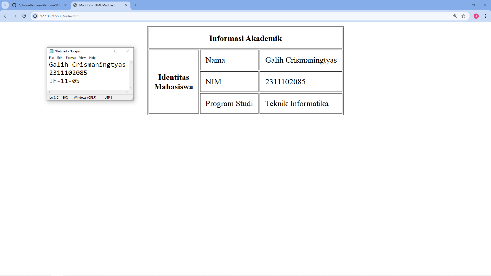

<div align="center">
  <br />
  <h1>LAPORAN PRAKTIKUM <br> APLIKASI BERBASIS PLATFORM </h1>
  <br />
  <h3>MODUL 2 <br> HTML </h3>
  <br />
  
  <br />
  <br />
  <br />
  <h3>Disusun Oleh :</h3>
  <p>
    <strong>Galih Crismaningtyas</strong>
    <br>
    <strong>2311102085</strong>
    <br>
    <strong>S1 IF-11-REG05</strong>
  </p>
  <br />
  <h3>Dosen Pengampu :</h3>
  <p>
    <strong>Dedi Agung Prabowo, S.Kom., M.Kom</strong>
  </p>
  <br />
  <br />
  <h4>Asisten Praktikum :</h4>
  <strong>Apri Pandu Wicaksono </strong>
  <br>
  <strong>Hamka Zaenul Ardi</strong>
  <br />
  <h3>LABORATORIUM HIGH PERFORMANCE <br>FAKULTAS INFORMATIKA <br>UNIVERSITAS TELKOM PURWOKERTO <br>2026 </h3>
</div>

<hr>

## Dasar Teori

## Filosofi dan Struktur Semantik
HTML adalah bahasa markah standar yang digunakan untuk menentukan struktur sebuah dokumen di web. Secara filosofis, HTML bukanlah bahasa pemrograman karena tidak memiliki logika kondisional (seperti if-else atau looping), melainkan sekumpulan tag yang memberi tahu browser bagaimana sebuah konten harus diinterpretasikan. Setiap elemen HTML bertindak sebagai blok penyusun (building blocks); misalnya, tag <h1> untuk judul utama, <p> untuk paragraf, dan <a> untuk tautan. Penggunaan tag yang tepat atau "Semantic HTML" sangat krusial, bukan hanya agar tampilan rapi, tetapi agar mesin pencari (SEO) dan perangkat bantu (seperti screen reader untuk tunanetra) dapat memahami konteks informasi yang disajikan.

## Anatomi Elemen dan Hirarki DOM
Setiap elemen HTML umumnya terdiri dari tiga bagian: tag pembuka, isi konten, dan tag penutup. Di dalam tag pembuka, kita sering menyisipkan atribut (seperti href, src, atau class) yang memberikan informasi tambahan atau instruksi khusus pada elemen tersebut. Ketika browser membaca file HTML, ia mengubah kode-kode tersebut menjadi struktur pohon yang disebut DOM (Document Object Model). Dalam hirarki ini, elemen dapat bersarang di dalam elemen lain (nesting), menciptakan hubungan "orang tua dan anak" (parent-child). Struktur inilah yang nantinya dimanipulasi oleh CSS untuk gaya visual dan JavaScript untuk interaksi dinamis, menjadikan HTML sebagai fondasi absolut dalam ekosistem pengembangan web.

## Tugas 2 - Ujian Web Purba

```
<!DOCTYPE html>
<html lang="en">
<head>
    <meta charset="UTF-8">
    <meta name="viewport" content="width=device-width, initial-scale=1.0">
    <title>Modul 2 - HTML Modified</title>
</head>
<body>
    <table border="1" align="center" cellpadding="10">
        <tr>
            <th colspan="3">Informasi Akademik</th>
        </tr>
        <tr>
            <td rowspan="3" align="center"><b>Identitas<br>Mahasiswa</b></td>
            <td>Nama</td>
            <td>Galih Crismaningtyas</td>
        </tr>
        <tr>
            <td>NIM</td>
            <td>2311102085</td>
        </tr>
        <tr>
            <td>Program Studi</td>
            <td>Teknik Informatika</td>
        </tr>
    </table>
</body>
</html>
```

Output:

