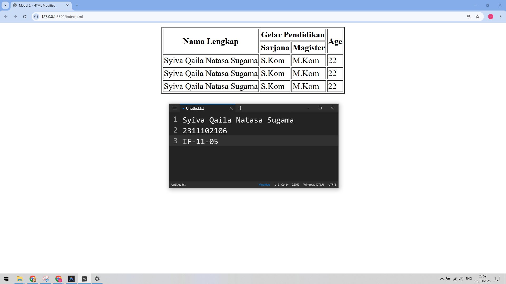

<div align="center">
  <br />
  <h1>LAPORAN PRAKTIKUM <br> APLIKASI BERBASIS PLATFORM </h1>
  <br />
  <h3>MODUL 2 <br> HTML </h3>
  <br />
  
  <br />
  <br />
  <br />
  <h3>Disusun Oleh :</h3>
  <p>
    <strong>Syiva Qaila Natasa Sugama</strong>
    <br>
    <strong>2311102106</strong>
    <br>
    <strong>S1 IF-11-REG05</strong>
  </p>
  <br />
  <h3>Dosen Pengampu :</h3>
  <p>
    <strong>Dedi Agung Prabowo, S.Kom., M.Kom</strong>
  </p>
  <br />
  <br />
  <h4>Asisten Praktikum :</h4>
  <strong>Apri Pandu Wicaksono </strong>
  <br>
  <strong>Hamka Zaenul Ardi</strong>
  <br />
  <h3>LABORATORIUM HIGH PERFORMANCE <br>FAKULTAS INFORMATIKA <br>UNIVERSITAS TELKOM PURWOKERTO <br>2026 </h3>
</div>

<hr>

## Dasar Teori

HTML atau HyperText Markup Language merupakan bahasa markah standar yang digunakan untuk menyusun struktur dan menyajikan konten di dalam World Wide Web. Sebagai fondasi utama pengembangan situs web, HTML bekerja dengan memanfaatkan serangkaian elemen yang ditandai oleh tag (seperti ``<html>``, ``<head>``, ``<body>``, ``<div>``, dan sebagainya) untuk mendefinisikan berbagai bagian dokumen, mulai dari judul, paragraf, daftar, hingga penyisipan media seperti gambar dan video. Karena sifatnya yang deklaratif, HTML berfungsi sebagai "kerangka" yang memberi tahu peramban (web browser) bagaimana elemen-elemen informasi harus disusun secara hierarkis dan logis agar dapat dibaca oleh pengguna.

Dalam ekosistem pengembangan web modern, HTML tidak berdiri sendiri melainkan bekerja secara sinergis dengan teknologi pendukung lainnya, terutama CSS (Cascading Style Sheets) untuk pengaturan tampilan dan JavaScript untuk penambahan interaktivitas. Evolusi HTML, yang kini berada pada standar HTML5, telah membawa banyak pembaruan signifikan, seperti pengenalan elemen semantik (seperti ``<article>``, ``<section>``, dan ``<nav>``) yang memungkinkan mesin pencari dan teknologi pendukung aksesibilitas untuk memahami struktur konten dengan lebih baik. Dengan penggunaan elemen semantik ini, dokumen menjadi lebih mudah dikelola, lebih ramah terhadap optimasi mesin pencari (SEO), dan memiliki struktur yang jauh lebih rapi dibanding versi sebelumnya.

Prinsip utama dalam penulisan HTML adalah menjaga integritas struktur dokumen agar tetap valid sesuai dengan spesifikasi yang ditetapkan oleh W3C (World Wide Web Consortium). Struktur yang valid menjamin bahwa konten situs web dapat diakses secara konsisten di berbagai perangkat dan peramban yang berbeda. Selain itu, pemahaman mendalam mengenai atribut elemen dan model objek dokumen (DOM) menjadi sangat penting bagi pengembang dalam membangun antarmuka pengguna yang dinamis. Dengan menguasai konsep dasar HTML, pengembang memiliki landasan yang kuat untuk membangun aplikasi berbasis web yang kompleks, skalabel, dan terstruktur dengan baik.

## Tugas 2 - Ujian Web Purba

```
<!DOCTYPE html>
<html lang="en">
<head>
    <meta charset="UTF-8">
    <meta name="viewport" content="width=device-width, initial-scale=1.0">
    <title>Modul 2 - HTML Modified</title>
</head>
<body>
     <table border="1" align="center">
        <tr>
            <th rowspan="2">Nama Lengkap</th>
            <th colspan="2">Gelar Pendidikan</th>
            <th rowspan="2">Age</th>
        </tr>
        <tr>
            <th>Sarjana</th>
            <th>Magister</th>
        </tr>
        <tr>
            <td>Syiva Qaila Natasa Sugama</td>
            <td>S.Kom</td>
            <td>M.Kom</td>
            <td>22</td>
        </tr>
        <tr>
            <td>Syiva Qaila Natasa Sugama</td>
            <td>S.Kom</td>
            <td>M.Kom</td>
            <td>22</td>
        </tr>
        <tr>
            <td>Syiva Qaila Natasa Sugama</td>
            <td>S.Kom</td>
            <td>M.Kom</td>
            <td>22</td>
        </tr>
    </table>
</body>
</html>
```

Output:

