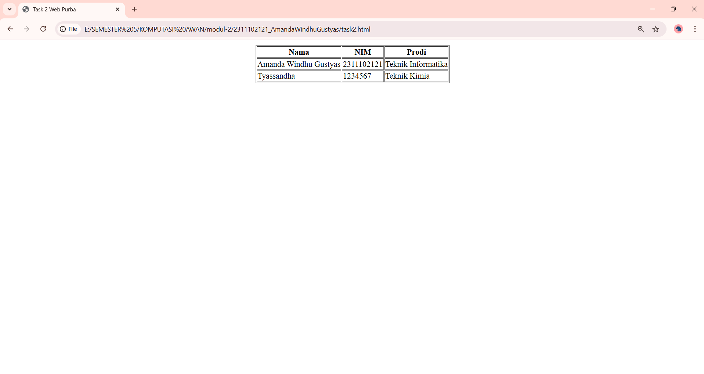

<div align="center">
  <br />
  <h1>LAPORAN PRAKTIKUM <br> APLIKASI BERBASIS PLATFORM </h1>
  <br />
  <h3>MODUL 2 <br> HTML </h3>
  <br />
  
  <br />
  <br />
  <br />
  <h3>Disusun Oleh :</h3>
  <p>
    <strong>Amanda Windhu Gustyas</strong>
    <br>
    <strong>2311102121</strong>
    <br>
    <strong>S1 IF-11-REG05</strong>
  </p>
  <br />
  <h3>Dosen Pengampu :</h3>
  <p>
    <strong>Dedi Agung Prabowo, S.Kom., M.Kom</strong>
  </p>
  <br />
  <br />
  <h4>Asisten Praktikum :</h4>
  <strong>Apri Pandu Wicaksono </strong>
  <br>
  <strong>Hamka Zaenul Ardi</strong>
  <br />
  <h3>LABORATORIUM HIGH PERFORMANCE <br>FAKULTAS INFORMATIKA <br>UNIVERSITAS TELKOM PURWOKERTO <br>2026 </h3>
</div>

<hr>

# Dasar Teori

HTML (HyperText Markup Language) merupakan bahasa markup standar yang digunakan untuk membangun dan menyusun struktur halaman web. HTML berfungsi untuk menentukan elemen-elemen yang akan ditampilkan pada browser, seperti teks, gambar, tabel, dan tautan. HTML bukan termasuk bahasa pemrograman karena tidak memiliki logika atau perhitungan, melainkan hanya digunakan untuk mengatur struktur dan tampilan dasar dari suatu halaman web. HTML terdiri dari sekumpulan tag yang digunakan untuk menandai setiap bagian dari dokumen. Tag biasanya ditulis berpasangan, yaitu tag pembuka dan tag penutup, yang membungkus suatu konten tertentu agar dapat dikenali oleh browser.<br>

Secara umum, dokumen HTML memiliki struktur utama yang terdiri dari bagian kepala (head) dan badan (body). Bagian head berisi informasi mengenai dokumen, seperti judul halaman, sedangkan bagian body berisi konten utama yang akan ditampilkan kepada pengguna. Struktur ini menjadi kerangka dasar dalam setiap pembuatan halaman web, sehingga browser dapat memahami bagaimana cara menampilkan isi dokumen dengan benar.<br>

Elemen HTML adalah komponen utama dalam penyusunan halaman web. Setiap elemen memiliki fungsi tertentu, seperti:
  1. Menampilkan judul atau heading<br>
  2. Menampilkan paragraf teks<br>
  3. Membuat tabel untuk menyajikan data<br>
  4. Menambahkan tautan (link) ke halaman lain<br>
  5. Menampilkan gambar<br>
Dengan kombinasi berbagai elemen tersebut, halaman web dapat disusun secara terstruktur dan informatif.<br>

Tabel dalam HTML digunakan untuk menyajikan data dalam bentuk baris dan kolom. Struktur tabel terdiri dari beberapa bagian utama, yaitu baris, kolom, dan sel data. Tabel sering digunakan untuk menampilkan informasi yang terorganisir, seperti daftar, jadwal, atau data numerik.<br>

Atribut merupakan informasi tambahan yang diberikan pada suatu elemen HTML. Atribut digunakan untuk mengatur karakteristik atau perilaku dari elemen tersebut, misalnya untuk menentukan posisi, ukuran, atau tampilan tertentu. Dalam HTML tradisional, atribut juga digunakan untuk mengatur tata letak secara langsung tanpa bantuan CSS.

# Tugas 1
```
//2311102121
//Amanda Windhu Gustyas

<!DOCTYPE html>
<html>
<head>
    <title>Task 2 Web Purba</title>
</head>
<body>

<table width="100%" height="100%">
    <tr>
        <td align="center" valign="middle">

            <table border="1">
                <tr>
                    <th>Nama</th>
                    <th>NIM</th>
                    <th>Prodi</th>
                </tr>
                <tr>
                    <td>Amanda Windhu Gustyas</td>
                    <td>2311102121</td>
                    <td>Teknik Informatika</td>
                </tr>
                <tr>
                    <td>Tyassandha</td>
                    <td>1234567</td>
                    <td>Teknik Kimia</td>
                </tr>
            </table>

        </td>
    </tr>
</table>

</body>
</html>
```
Output:


