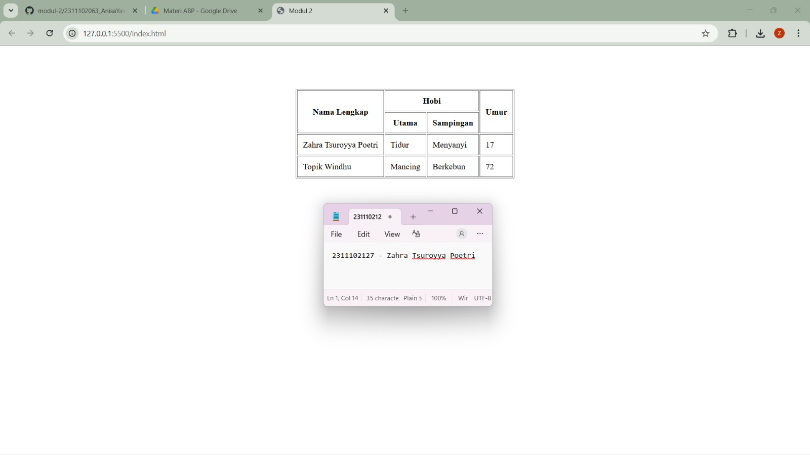

<div align="center">
  <br />
  <h1>LAPORAN PRAKTIKUM <br> APLIKASI BERBASIS PLATFORM </h1>
  <br />
  <h3>MODUL 2 <br> HTML </h3>
  <br />
  
  <br />
  <br />
  <br />
  <h3>Disusun Oleh :</h3>
  <p>
    <strong>Zahra Tsuroyya Poetri</strong>
    <br>
    <strong>2311102127</strong>
    <br>
    <strong>S1 IF-11-REG05</strong>
  </p>
  <br />
  <h3>Dosen Pengampu :</h3>
  <p>
    <strong>Dedi Agung Prabowo, S.Kom., M.Kom</strong>
  </p>
  <br />
  <br />
  <h4>Asisten Praktikum :</h4>
  <strong>Apri Pandu Wicaksono </strong>
  <br>
  <strong>Hamka Zaenul Ardi</strong>
  <br />
  <h3>LABORATORIUM HIGH PERFORMANCE <br>FAKULTAS INFORMATIKA <br>UNIVERSITAS TELKOM PURWOKERTO <br>2026 </h3>
</div>

<hr>

### Dasar Teori

Hypertext Markup Language (HTML) merupakan bahasa pemrograman yang digunakan untuk menampilkan sebuah website. HTML berasal dari gabungan kata "hypertext" yaitu teks atau media berisi link yang bisa mengarahkanmu ke halaman lain di suatu website. Di sisi lain, "markup language" merupakan bahasa komputer yang menggunakan tanda (tag) untuk menerjemahkan perintah di website. Keduanya digabungkan menjadi bahasa untuk membuat struktur website. HTML termasuk dalam bahasa pemrograman gratis, artinya tidak dimiliki oleh siapapun, pengembangannya dilakukan oleh banyak orang di banyak negara dan bisa dikatakan sebagai sebuah bahasa yang dikembangkan bersama-sama secara global. Dokumen HTML adalah dokumen teks yang dapat diedit oleh editor teks apapun. Dan disimpan dengan file extension .html. Dokumen HTML punya beberapa elemen yang dikelilingi oleh tag-teks yangd dimulai dengan symbol "<" dan berakhir dengan sebuah symbol ">"

### Tugas 2 - Ujian Web Purba (HTML)
```
<!DOCTYPE html>
<html>
    <head>
        <title>Modul 2</title>
    </head>

    <body>

        <br><br><br><br>

        <center>

            <table border="1" cellpadding="10">
                
                <tr>
                    <th rowspan="2">Nama Lengkap</th>
                    <th colspan="2">Hobi</th>
                    <th rowspan="2">Umur</th>
                </tr>

                <tr>
                    <th>Utama</th>
                    <th>Sampingan</th>
                </tr>

                <tr>
                    <td>Zahra Tsuroyya Poetri</td>
                    <td>Tidur</td>
                    <td>Menyanyi</td>
                    <td>17</td>
                </tr>

                <tr>
                    <td>Topik Windhu</td>
                    <td>Mancing</td>
                    <td>Berkebun</td>
                    <td>72</td>
                </tr>

            </table>

        </center>

    </body>
</html>

```
### Hasil Output



### Deskripsi Kode

Kode HTML di atas digunakan untuk membuat halaman web sederhana yang menampilkan tabel data. Deklarasi `<!DOCTYPE html>` menunjukkan bahwa dokumen menggunakan standar HTML5. Tag `<html>` membungkus seluruh isi halaman, sedangkan `<head>` berisi informasi seperti judul pada tag `<title>`.

Pada bagian `<body>` digunakan beberapa tag `<br>` untuk memberi jarak dari bagian atas halaman, dan tag `<center>` untuk menempatkan tabel di tengah tanpa menggunakan CSS.

Tabel dibuat menggunakan tag `<table>` dengan atribut `border="1"` dan `cellpadding="10"`. Struktur tabel terdiri dari `<tr>` sebagai baris, `<th>` sebagai header, dan `<td>` sebagai data. Atribut `rowspan` dan `colspan` digunakan untuk menggabungkan sel pada tabel.

### Refrensi
[1] D. M. Kusumawardani, Darmansah, S. Astiti, M. Y. Fathoni, D. Sunardi, dan S. Fernandez, *Web Dasar Menggunakan HTML, CSS, JS, PHP dan Studi Kasus*. Jambi: PT. Sonpedia Publishing Indonesia, 2023.
