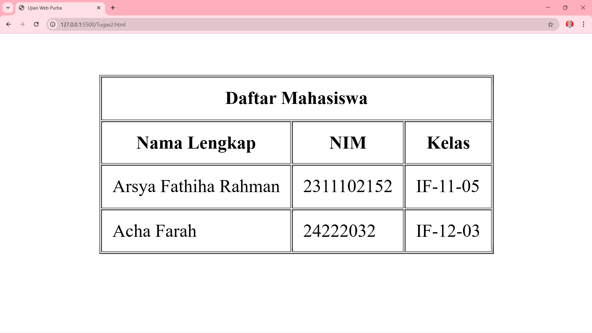

<div align="center">
  <br />
  <h1>LAPORAN PRAKTIKUM <br> APLIKASI BERBASIS PLATFORM </h1>
  <br />
  <h3>MODUL 2 <br> HTML </h3>
  <br />
  
  <br />
  <br />
  <br />
  <h3>Disusun Oleh :</h3>
  <p>
    <strong>Arsya Fathiha Rahman</strong>
    <br>
    <strong>2311102152</strong>
    <br>
    <strong>S1 IF-11-REG05</strong>
  </p>
  <br />
  <h3>Dosen Pengampu :</h3>
  <p>
    <strong>Dedi Agung Prabowo, S.Kom., M.Kom</strong>
  </p>
  <br />
  <br />
  <h4>Asisten Praktikum :</h4>
  <strong>Apri Pandu Wicaksono </strong>
  <br>
  <strong>Hamka Zaenul Ardi</strong>
  <br />
  <h3>LABORATORIUM HIGH PERFORMANCE <br>FAKULTAS INFORMATIKA <br>UNIVERSITAS TELKOM PURWOKERTO <br>2026 </h3>
</div>

<hr>

# Dasar Teori
# Dasar Teori HTML

## 1. Penjelasan HTML
HTML (HyperText Markup Language) adalah bahasa markup yang digunakan untuk membangun struktur dasar suatu halaman web. HTML berperan dalam mengatur bagaimana konten seperti teks, gambar, tautan, tabel, dan elemen lainnya disusun agar dapat ditampilkan oleh browser.

HTML bukan merupakan bahasa pemrograman karena tidak memiliki logika seperti perulangan atau percabangan. HTML hanya berfungsi sebagai penanda struktur menggunakan tag.

- **HyperText**: kemampuan menghubungkan halaman melalui link.
- **Markup**: proses memberi tanda pada konten menggunakan tag.

Versi yang umum digunakan saat ini adalah **HTML5**, yang telah mendukung fitur modern seperti audio, video, dan elemen interaktif.

---

## 2. Sejarah Singkat HTML
HTML pertama kali diperkenalkan oleh Tim Berners-Lee pada awal tahun 1990-an sebagai bagian dari pengembangan World Wide Web. Pada awalnya, HTML digunakan untuk berbagi dokumen sederhana.

Seiring perkembangan teknologi, HTML terus mengalami pembaruan hingga lahir HTML5 sebagai versi terbaru yang menawarkan peningkatan dari sisi struktur dan dukungan multimedia.

---

## 3. Peran HTML dalam Pengembangan Web
Dalam pengembangan web, HTML bekerja bersama dua teknologi utama lainnya:

| Teknologi   | Peran                        |
|------------|-----------------------------|
| HTML       | Menyusun struktur konten    |
| CSS        | Mengatur tampilan           |
| JavaScript | Menambahkan interaktivitas  |

HTML menjadi fondasi utama karena semua elemen web dibangun di atas struktur HTML.

---

## 4. Struktur Dasar Dokumen HTML
Dokumen HTML memiliki struktur dasar sebagai berikut:

- `<!DOCTYPE html>` → Menandakan penggunaan HTML5  
- `<html>` → Elemen utama  
- `<head>` → Berisi metadata (judul, charset, dll)  
- `<body>` → Berisi konten utama yang ditampilkan  

Bagian `<head>` tidak terlihat langsung oleh pengguna, sedangkan `<body>` berisi seluruh isi halaman.

---

## 5. Konsep Dasar HTML

Beberapa konsep penting dalam HTML:

| Istilah       | Penjelasan                                      |
|--------------|-------------------------------------------------|
| Tag          | Penanda elemen dengan tanda kurung sudut        |
| Elemen       | Gabungan tag pembuka, isi, dan penutup          |
| Atribut      | Informasi tambahan dalam tag                    |
| Self-closing | Tag tanpa penutup                               |
| Nested       | Elemen yang berada di dalam elemen lain         |

Contoh:
```html
<p>Contoh paragraf</p>


# Tugas 2
```
//2311102152
//Arsya Fathiha Rahman

# Penugasan 2: Pembuatan Tabel HTML (Web Purba)

## Deskripsi Tugas
Pada penugasan ini, mahasiswa diminta untuk membuat sebuah tampilan tabel sederhana menggunakan HTML. Tabel tersebut harus berisi data dasar.

---

### 💻 Kode Program

```html
<!DOCTYPE html>
<html>
<head>
    <title>Data Mahasiswa Web Purba</title>
</head>

<body>

<!-- center horizontal -->
<center>

    <!-- kasih jarak biar agak ke tengah -->
    <br><br><br><br>

    <!-- tabel utama -->
    <table border="1" cellpadding="9" cellspacing="1">

        <!-- judul -->
        <tr>
            <th colspan="3">Daftar Mahasiswa</th>
        </tr>

        <!-- header -->
        <tr>
            <th>Nama Lengkap</th>
            <th>NIM</th>
            <th>Kelas</th>
        </tr>

        <!-- data -->
        <tr>
            <td>Arsya Fathiha Rahman</td>
            <td>2311102152</td>
            <td>IF-11-05</td>
        </tr>

        <tr>
            <td>Acha Farah</td>
            <td>24222032</td>
            <td>IF-12-03</td>
        </tr>

    </table>

</center>

</body>
</html>

### 📸 Hasil Tampilan


