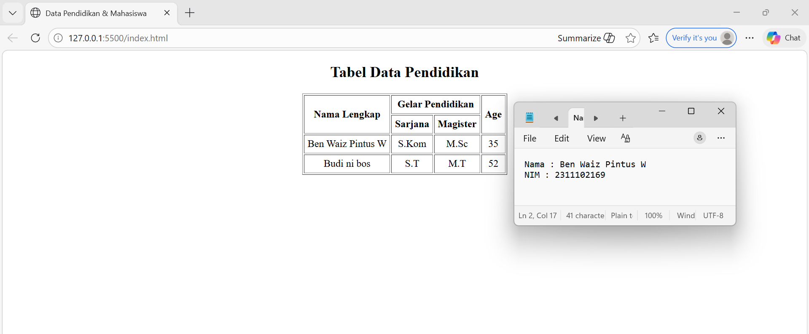

<div align="center">
  <br />
  <h1>LAPORAN PRAKTIKUM <br> APLIKASI BERBASIS PLATFORM </h1>
  <br />
  <h3>MODUL 2 <br> HTML </h3>
  <br />
  
  <br />
  <br />
  <br />
  <h3>Disusun Oleh :</h3>
  <p>
    <strong>Ben Waiz Pintus Widyosaputro</strong>
    <br>
    <strong>2311102169</strong>
    <br>
    <strong>S1 IF-11-REG05</strong>
  </p>
  <br />
  <h3>Dosen Pengampu :</h3>
  <p>
    <strong>Dedi Agung Prabowo, S.Kom., M.Kom</strong>
  </p>
  <br />
  <br />
  <h4>Asisten Praktikum :</h4>
  <strong>Apri Pandu Wicaksono </strong>
  <br>
  <strong>Hamka Zaenul Ardi</strong>
  <br />
  <h3>LABORATORIUM HIGH PERFORMANCE <br>FAKULTAS INFORMATIKA <br>UNIVERSITAS TELKOM PURWOKERTO <br>2026 </h3>
</div>

<hr>

## Dasar Teori
HTML (HyperText Markup Language) merupakan bahasa markup standar yang digunakan untuk membuat dan menyusun struktur halaman web. HTML digunakan untuk menentukan berbagai elemen pada halaman web seperti teks, gambar, tabel, tautan, dan formulir sehingga dapat ditampilkan dengan baik pada browser. Dalam HTML, struktur halaman dibangun menggunakan berbagai tag seperti <html>, <head>, <title>, dan <body>. Setiap tag memiliki fungsi tertentu untuk mengatur bagaimana konten ditampilkan dan diorganisasi di dalam halaman web.

HTML biasanya digunakan bersama dengan teknologi lain seperti CSS untuk mengatur tampilan dan desain halaman, serta JavaScript untuk menambahkan interaksi dan fungsi dinamis pada website. Kombinasi ketiga teknologi ini menjadi dasar utama dalam pengembangan web modern, sehingga memungkinkan pembuatan website yang lebih menarik, interaktif, dan responsif bagi pengguna.

## Tugas 2 - Ujian Web Purba

```
<!DOCTYPE html>
<html lang="en">
<head>
    <meta charset="UTF-8">
    <title>Data Pendidikan & Mahasiswa</title>
</head>

<body>

    <!-- TABEL DATA PENDIDIKAN -->

    <h2 align="center">Tabel Data Pendidikan</h2>

    <table border="1" align="center" cellpadding="5">
        <tr>
            <th rowspan="2">Nama Lengkap</th>
            <th colspan="2">Gelar Pendidikan</th>
            <th rowspan="2">Age</th>
        </tr>
        <tr>
            <th>Sarjana</th>
            <th>Magister</th>
        </tr>
        <tr>
            <td align="center">Ben Waiz Pintus W</td>
            <td align="center">S.Kom</td>
            <td align="center">M.Sc</td>
            <td align="center">35</td>
        </tr>
        <tr>
            <td align="center">Budi ni bos</td>
            <td align="center">S.T</td>
            <td align="center">M.T</td>
            <td align="center">52</td>
        </tr>
    </table>
</body>
</html>
```

Output:
