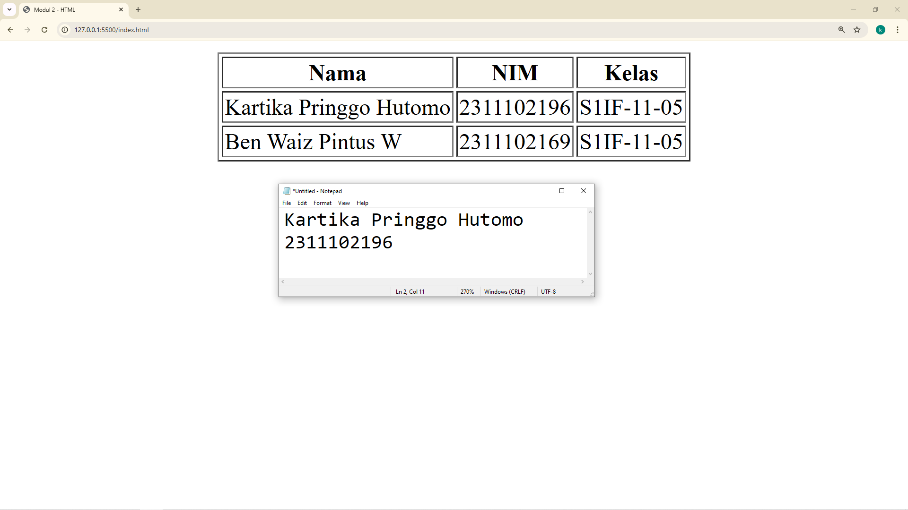

<div align="center">
  <br />
  <h1>LAPORAN PRAKTIKUM <br> APLIKASI BERBASIS PLATFORM </h1>
  <br />
  <h3>MODUL 2 <br> HTML </h3>
  <br />
  
  <br />
  <br />
  <br />
  <h3>Disusun Oleh :</h3>
  <p>
    <strong>Kartika Pringgo Hutomo</strong>
    <br>
    <strong>2311102196</strong>
    <br>
    <strong>S1 IF-11-REG05</strong>
  </p>
  <br />
  <h3>Dosen Pengampu :</h3>
  <p>
    <strong>Dedi Agung Prabowo, S.Kom., M.Kom</strong>
  </p>
  <br />
  <br />
  <h4>Asisten Praktikum :</h4>
  <strong>Apri Pandu Wicaksono </strong>
  <br>
  <strong>Hamka Zaenul Ardi</strong>
  <br />
  <h3>LABORATORIUM HIGH PERFORMANCE <br>FAKULTAS INFORMATIKA <br>UNIVERSITAS TELKOM PURWOKERTO <br>2026 </h3>
</div>

<hr>

## Dasar Teori

HTML (HyperText Markup Language) merupakan bahasa markup standar yang digunakan untuk membuat dan menyusun struktur halaman web. HTML berfungsi untuk menentukan elemen-elemen yang ada pada sebuah halaman web seperti teks, gambar, tautan, tabel, formulir, dan berbagai komponen lainnya. HTML bekerja dengan menggunakan tag atau markup yang berfungsi untuk memberi makna dan struktur pada konten yang ditampilkan di browser. Browser seperti Google Chrome, Mozilla Firefox, atau Microsoft Edge akan membaca dokumen HTML dan menampilkan struktur halaman sesuai dengan tag yang digunakan.

Dalam HTML, setiap elemen biasanya terdiri dari tag pembuka, konten, dan tag penutup, misalnya <p>...</p> untuk paragraf atau <h1>...</h1> untuk judul utama. HTML juga mendukung penggunaan atribut yang memberikan informasi tambahan pada elemen, seperti atribut src pada tag  untuk menentukan sumber gambar atau atribut href pada tag <a> untuk menentukan alamat tautan. Struktur dasar dari sebuah dokumen HTML biasanya terdiri dari elemen <html>, <head>, dan <body> yang masing-masing memiliki fungsi berbeda dalam menentukan metadata serta konten utama halaman web.

Dalam pengembangan web modern, HTML tidak bekerja sendiri melainkan dikombinasikan dengan CSS (Cascading Style Sheets) untuk mengatur tampilan visual dan JavaScript untuk menambahkan interaktivitas pada halaman web. HTML berperan sebagai fondasi utama dalam pembangunan antarmuka web karena seluruh elemen yang ditampilkan kepada pengguna berasal dari struktur yang ditentukan oleh HTML. Oleh karena itu, pemahaman yang baik mengenai HTML menjadi dasar penting dalam pengembangan aplikasi web, baik untuk website statis maupun aplikasi web modern yang kompleks.

## Tugas 2 - Ujian Web Purba

```
<!-- 2311102196 Kartika Pringgo Hutomo S1IF-11-05 -->

<!DOCTYPE html>
<html lang="en">
<head>
    <meta charset="UTF-8">
    <meta name="viewport" content="width=device-width, initial-scale=1.0">
    <title>Modul 2 - HTML</title>
</head>
<body>
    <table align="center" border="1">
        <tr>
            <th>Nama</th>
            <th>NIM</th>
            <th>Kelas</th>
        </tr>
        <tr>
            <td>Kartika Pringgo Hutomo</td>
            <td>2311102196</td>
            <td>S1IF-11-05</td>
        </tr>
        <tr>
            <td>Ben Waiz Pintus W</td>
            <td>2311102169</td>
            <td>S1IF-11-05</td>
        </tr>
    </table>
</body>
</html>
```

Output:

