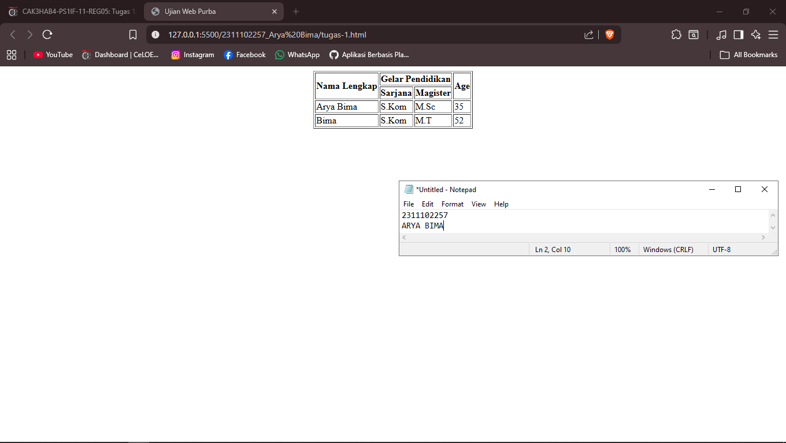

<div align="center">
  <br />
  <h1>LAPORAN PRAKTIKUM <br> APLIKASI BERBASIS PLATFORM </h1>
  <br />
  <h3>MODUL 2 <br> HTML </h3>
  <br />
  
  <br />
  <br />
  <br />
  <h3>Disusun Oleh :</h3>
  <p>
    <strong>Arya Bima</strong>
    <br>
    <strong>2311102257</strong>
    <br>
    <strong>S1 IF-11-REG05</strong>
  </p>
  <br />
  <h3>Dosen Pengampu :</h3>
  <p>
    <strong>Dedi Agung Prabowo, S.Kom., M.Kom</strong>
  </p>
  <br />
  <br />
  <h4>Asisten Praktikum :</h4>
  <strong>Apri Pandu Wicaksono </strong>
  <br>
  <strong>Hamka Zaenul Ardi</strong>
  <br />
  <h3>LABORATORIUM HIGH PERFORMANCE <br>FAKULTAS INFORMATIKA <br>UNIVERSITAS TELKOM PURWOKERTO <br>2026 </h3>
</div>

<hr>

# Dasar Teori

### 1. Pengertian HTML

HTML (HyperText Markup Language) adalah bahasa markup standar yang digunakan untuk membuat dan menyusun struktur serta konten halaman web. HTML bukan bahasa pemrograman, melainkan bahasa markup yang memberi tahu browser bagaimana menampilkan teks, gambar, tautan, video, dan elemen lainnya di layar.

- HyperText => kemampuan menghubungkan satu dokumen ke dokumen lain melalui hyperlink.
- Markup => menggunakan tag untuk “menandai” atau memberi makna pada konten.
- Versi yang paling banyak digunakan saat ini: HTML5 (standar resmi sejak 2014 dan terus dikembangkan).

### 2. Peran HTML dalam Pengembangan Web (Web Stack)

| Teknologi  | Fungsi                  | Contoh                     |
| ---------- | ----------------------- | -------------------------- |
| HTML       | Struktur & konten       | Tulisan, gambar, tabel     |
| CSS        | Tampilan & desain       | Warna, layout, animasi     |
| JavaScript | Interaktivitas & logika | Tombol klik, form validasi |

HTML adalah fondasi, tanpa HTML yang baik, CSS dan JavaScript tidak akan punya tempat untuk bekerja dengan benar.

### 3. Konsep Utama dalam HTML

| Istilah      | Penjelasan                                             | Contoh                      |
| ------------ | ------------------------------------------------------ | --------------------------- |
| Tag          | Penanda pembuka dan penutup (kurung sudut)             | `<p>`, `</p>`               |
| Elemen       | Keseluruhan tag + isi di dalamnya                      | `<p>Halo dunia</p>`         |
| Atribut      | Informasi tambahan di dalam tag pembuka (nama="nilai") | `href="https://google.com"` |
| Self-closing | Tag yang tidak butuh penutup                           | ``, `<br>`, `<hr>`     |
| Nested       | Elemen di dalam elemen lain                            | `<div><p>teks</p></div>`    |

### 4. Elemen-elemen Dasar yang Sering Digunakan

| Elemen                 | Fungsi                                                      | Contoh Penggunaan                      |
| ---------------------- | ----------------------------------------------------------- | -------------------------------------- |
| `<h1>` - `<h6>`        | Judul (heading) - semakin besar angka, semakin kecil ukuran | `<h1>Judul Utama</h1>`                 |
| `<p>`                  | Paragraf                                                    | Teks biasa                             |
| `<a>`                  | Hyperlink / tautan                                          | `<a href="https://...">Klik sini</a>`  |
| ``                | Menyisipkan gambar                                          | `` |
| `<div>`                | Kontainer generik (non-semantic)                            | Grouping elemen                        |
| `<span>`               | Kontainer inline generik                                    | Styling sebagian teks                  |
| `<ul>`, `<ol>`, `<li>` | Daftar tak berurutan & berurutan                            | Menu, langkah-langkah                  |
| `<strong>` / `<b>`     | Teks tebal (strong = penting)                               | `<strong>Penting!</strong>`            |
| `<em>` / `<i>`         | Teks miring (em = emphasis)                                 | `<em>Penekanan</em>`                   |

### 5. Semantic HTML (HTML5) - Elemen Bermakna

Semantic HTML menggunakan elemen yang menggambarkan makna konten, bukan hanya tampilan. Manfaatnya:

- Lebih mudah dibaca mesin (SEO lebih baik)
- Aksesibilitas (screen reader) jauh lebih baik
- Kode lebih mudah dipelihara

| Elemen Semantic             | Arti / Fungsi                                 |
| --------------------------- | --------------------------------------------- |
| `<header>`                  | Bagian header (logo, judul situs, nav)        |
| `<nav>`                     | Area navigasi utama                           |
| `<main>`                    | Konten utama halaman (hanya satu per halaman) |
| `<article>`                 | Konten mandiri (artikel, posting blog)        |
| `<section>`                 | Kelompok konten bertema                       |
| `<aside>`                   | Konten samping (sidebar, iklan)               |
| `<footer>`                  | Bagian kaki halaman (copyright, kontak)       |
| `<figure>` + `<figcaption>` | Gambar + keterangan                           |

### 6. Atribut Global yang Penting

| Atribut | Fungsi                                       | Contoh                                                |
| ------- | -------------------------------------------- | ----------------------------------------------------- |
| `id`    | Identifier unik di halaman                   | `id="header-utama"`                                   |
| `class` | Kelompok elemen (bisa banyak elemen)         | `class="btn btn-primary"`                             |
| `lang`  | Menentukan bahasa konten                     | `<html lang="id">`                                    |
| `title` | Tooltip saat hover                           | `<abbr title="HyperText Markup Language">HTML</abbr>` |
| `alt`   | Teks alternatif gambar (aksesibilitas & SEO) | Wajib pada ``                                    |

---

# Tugas 1 - Web Purba

```html
<!-- 2311102257 - Arya Bima -->
<!doctype html>
<html lang="en">
  <head>
    <meta charset="UTF-8" />
    <meta name="viewport" content="width=device-width, initial-scale=1.0" />
    <title>Ujian Web Purba</title>
  </head>
  <body>
    <center>
      <table border="1">
        <tr>
          <th rowspan="2">Nama Lengkap</th>
          <th colspan="2">Gelar Pendidikan</th>
          <th rowspan="2">Age</th>
        </tr>
        <tr>
          <th>Sarjana</th>
          <th>Magister</th>
        </tr>
        <tr>
          <td>Arya Bima</td>
          <td>S.Kom</td>
          <td>M.Sc</td>
          <td>35</td>
        </tr>
        <tr>
          <td>Bima</td>
          <td>S.Kom</td>
          <td>M.T</td>
          <td>52</td>
        </tr>
      </table>
    </center>
  </body>
</html>
```

Output:

