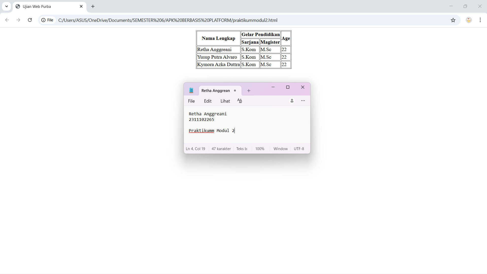

   
  <h1>LAPORAN PRAKTIKUM   APLIKASI BERBASIS PLATFORM </h1>
   
  <h3>MODUL 2  HTML </h3>
   
  
   
   
   
  <h3>Disusun Oleh :</h3>
  

    <strong>Retha Anggreani</strong>
     
    <strong>2311102265</strong>
     
    <strong>S1 IF-11-REG-05</strong>
  

   
  <h3>Dosen Pengampu :</h3>
  

    <strong>Dedi Agung Prabowo, S.Kom., M.Kom</strong>
  

   
   
  <h4>Asisten Praktikum :</h4>
  <strong>Apri Pandu Wicaksono </strong>
   
  <strong>Hamka Zaenul Ardi</strong>
   
  <h3>LABORATORIUM HIGH PERFORMANCE  FAKULTAS INFORMATIKA  UNIVERSITAS TELKOM PURWOKERTO  2026 </h3>

## Dasar Teori

HTML (HyperText Markup Language) merupakan bahasa markup yang berfungsi untuk menyusun kerangka dan struktur dasar sebuah halaman website. Melalui HTML, kita bisa menampilkan berbagai elemen mulai dari teks, gambar, tabel, hingga formulir di dalam browser. Penting untuk dipahami bahwa HTML bukan merupakan bahasa pemrograman, melainkan bahasa markup yang menggunakan sistem tag untuk mengatur tata letak kontennya. Bahasa ini pertama kali dibuat pada tahun 1991 oleh Tim Berners-Lee di CERN dengan tujuan awal untuk memudahkan para peneliti dalam berbagi dokumen. Kini, HTML telah berkembang menjadi versi HTML5 yang lebih modern karena sudah mendukung fitur multimedia dan grafik secara langsung.

## Fungsi HTML dalam Pengembangan Web
1. HTML

Fungsi: Menyusun struktur dan isi halaman
Contoh: Judul, paragraf, gambar, tabel

2. CSS

Fungsi: Mengatur tampilan dan estetika halaman
Contoh: Warna background, ukuran font, layout

3. JavaScript

Fungsi: Menambahkan interaksi dan logika
Contoh: Validasi form, slider gambar, tombol klik

Catatan: HTML adalah fondasi utama. Tanpa struktur HTML yang jelas, CSS dan JavaScript tidak bisa bekerja dengan benar, sehingga halaman web tidak akan tampil sebagaimana mestinya.

## Konsep Dasar HTML
HTML dibangun dari beberapa konsep dasar. Tag digunakan untuk menandai awal dan akhir sebuah konten, sedangkan elemen adalah gabungan antara tag dan isi di dalamnya. Setiap tag bisa memiliki atribut, yang memberikan informasi tambahan atau pengaturan tertentu, misalnya alamat tautan atau sumber gambar. Ada juga tag yang bersifat self-closing, artinya tidak perlu penutup, seperti (img) dan (br). Selain itu, elemen HTML bisa ditempatkan di dalam elemen lain (nested) untuk membuat struktur halaman lebih teratur dan mudah dipahami.

## Semantic HTML (HTML5)

Selain elemen dasar, HTML5 memperkenalkan elemen semantic yang membawa makna khusus bagi konten yang ditempatkan di dalamnya. Misalnya, header digunakan untuk bagian atas halaman seperti logo, judul, atau navigasi, sedangkan nav khusus untuk area menu utama. Main menandai konten utama yang hanya ada satu per halaman, dan article digunakan untuk konten mandiri seperti artikel atau posting blog. Section digunakan untuk mengelompokkan konten yang memiliki tema sama, sedangkan aside dipakai untuk informasi tambahan atau sidebar. Footer ditempatkan di bagian bawah halaman untuk informasi seperti hak cipta atau kontak. Untuk menampilkan gambar dengan keterangan, digunakan kombinasi figure dan figcaption. Penggunaan elemen semantic membuat halaman lebih mudah dibaca oleh mesin pencari, lebih ramah aksesibilitas, dan memudahkan pemeliharaan kode.

## Tugas 2 - Ujian Web Purba 
<!-- 2311102257 - Retha Anggreani -->
<!DOCTYPE html>
<html lang="id">
  <head>
    <meta charset="UTF-8" />
    <meta name="viewport" content="width=device-width, initial-scale=1.0" />
    <title>Ujian Web Purba</title>
  </head>
  <body>
    

      <table border="1">
        <tr>
          <th rowspan="2">Nama Lengkap</th>
          <th colspan="2">Gelar Pendidikan</th>
          <th rowspan="2">Age</th>
        </tr>
        <tr>
          <th>Sarjana</th>
          <th>Magister</th>
        </tr>
        <tr>
          <td>Retha Anggreani</td>
          <td>S.Kom</td>
          <td>M.Sc</td>
          <td>22</td>
        </tr>
        <tr>
          <td>Yusup Putra Alvaro</td>
          <td>S.Kom</td>
          <td>M.Sc</td>
          <td>22</td>
        </tr>
        <tr>
          <td>Kymora Azka Duttra</td>
          <td>S.Kom</td>
          <td>M.Sc</td>
          <td>22</td>
        </tr>
      </table>
    

  </body>
</html>

Output :

## Kesimpulan 
HTML adalah dasar untuk membangun halaman web. Dengan memahami elemen dasar, elemen semantic, dan atribut global, kita bisa membuat halaman yang terstruktur dengan baik, mudah diakses, dan lebih gampang diatur tampilannya menggunakan CSS dan JavaScript.