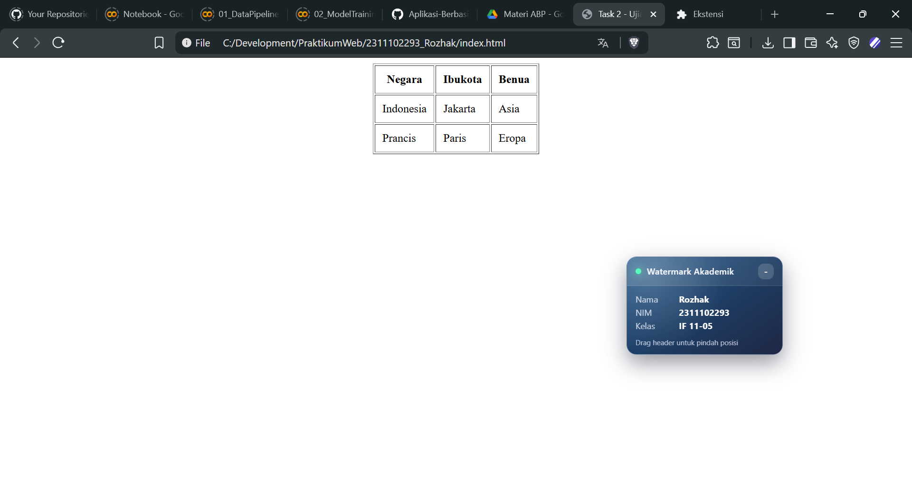

<div align="center">
    <br />
    <h1>LAPORAN PRAKTIKUM <br> APLIKASI BERBASIS PLATFORM </h1>
    <br />
    <h3>MODUL 2 <br> HTML </h3>
    <br />
    
    <br />
    <br />
    <br />
    <h3>Disusun Oleh :</h3>
    <p>
        <strong>Rozhak</strong>
        <br>
        <strong>2311102293</strong>
        <br>
        <strong>S1 IF-11-REG05</strong>
    </p>
    <br />
    <h3>Dosen Pengampu :</h3>
    <p>
        <strong>Dedi Agung Prabowo, S.Kom., M.Kom</strong>
    </p>
    <br />
    <br />
    <h4>Asisten Praktikum :</h4>
    <strong>Apri Pandu Wicaksono </strong>
    <br>
    <strong>Hamka Zaenul Ardi</strong>
    <br />
    <h3>LABORATORIUM HIGH PERFORMANCE <br>FAKULTAS INFORMATIKA <br>UNIVERSITAS TELKOM PURWOKERTO <br>2026 </h3>
</div>
<hr>

## Dasar Teori

**HTML** (_HyperText Markup Language_) merupakan bahasa markup standar yang digunakan untuk membangun struktur dasar sebuah halaman web. HTML bersungi untuk mendefinisikan elemen-elemen pada halaman seperti teks, gambar, tautan, tabel, hingga form yang akan ditampilkan pada browser. HTML tidak bersifat sebagai bahasa pemrograman, melainkan bahasa markup yang menggunakan tag untuk menandai struktur konten pada dokumen web.

Struktur dasar dokumen HTML terdisi dari beberapa elemen utama seperti `<!DOCTYPE html>` yang mendefinisikan dokumen sebagai HTML 5, elemen `<html>` sebagai root dari seluruh halaman, `<head>` yang berisi metadata dokumen, serta `<body>` yang menampilkan seluruh konten yang terlihat oleh pengguna pada halaman web.

HTML menggunakan **tag** sebagai penanda elemen. Sebagian besar tag memiliki pasangan tag pembuka dan penutup seperti `<p> </p>` atau `<h1> </h1>`. Konten yang ingin ditampilkan diletakkan diantara kedua tag tersebut. Selain itu terdapat beberapa tag tunggal seperti `<br>` atau `` yang tidak memiliki tag penutup.

Setiap elemen HTML juga memiliki **atribut** yang berfungsi memberikan informasi tambahan pada elemen tersebut, seperti `id`, `class`, `href`, `src`, atau `type`. Atribut biasanya dituliskan pada tag pembuka dengan format `atribut="value"`. Atribut ini sering digunakan untuk keperluan pengaturan tampilan menggunakan CSS maupun interaksi menggunakan JavaScript.

Dalam pengembangan halaman web, HTML menyediakan berbagai elemen penting seperti **heading** (`<h1>` hingga `<h6>`) untuk struktur judul, **hyperlink** (`<a>`) untuk navigasi antar halaman, **tabel** (`<table>`) untuk menampilkan data terstruktur, **image** (``) untuk menampilkan gambar, serta **form** (`<form>`) yang digunakan untuk menerima input data dari pengguna. Elemen-elemen ini menjadi dasar dalam membangun antarmuka sebuah website.

## Tugas 2: Ujian Web Purba

### 1. Source Code

```html
...
<body>
    <center>
        <table border="1" cellpadding="10">
            <tr>
                <th>Negara</th>
                <th>Ibukota</th>
                <th>Benua</th>
            </tr>
            <tr>
                <td>Indonesia</td>
                <td>Jakarta</td>
                <td>Asia</td>
            </tr>
            <tr>
                <td>Prancis</td>
                <td>Paris</td>
                <td>Eropa</td>
            </tr>
        </table>
    </center>
</body>
...
```

> Kode Lengkap: [index.html](index.html)

### 2. Penjelasan

Kode HTML pada tugas ini digunakan untuk menampilkan **tabel data sederhana** yang berisi informasi negara, ibu kota, dan benua. Struktur dokumen dimulai dengan deklarasi `<!DICTYPE html>` yang menandakan bahwa dokumen menggunakan standar **HTML 5**, diikuti elemen `<html>`, `<head>`, dan `<body>` sebagai struktur utama halaman web.

Pada bagian `<head>` terdapat beberapa elemen **metadata** seperti `<meta charset="UTF-8">` untuk pengaturan encoding karakter, `<meta name="viewport">` untuk pengaturan tampilan pada perangkat responsif, serta informasi tambahan seperti `author`, `nim`, dan `description` yang mendeskripsikan halaman. Judul halaman ditentukan menggunakan tag `<title>` sehingga teks tersebut akan muncul pada tab browser.

Konten utama berada pada elemen `<body>`. Untuk menempatkan tabel tepat di **tengah layar tanpa menggunakan CSS**, digunakan tag HTML lama yaitu `<center>`. Tag ini secara otomatis memposisikan seluruh elemen di dalamnya ke tengah halaman. Di dalam tag tersebut terdapat elemen `<table>` yang digunakan untuk menampilkan data dalam bentuk tabel.

Tabel terdiri dari beberapa elemen utama yaitu `<tr>` untuk mendefinisikan baris tabel, `<th>` untuk header kolom, dan `<td>` untuk isi data. Atribut `border="1"` digunakan untuk menampilkan garis tabel, sedangkan `cellpadding="10"` memberikan jarak antara konten dan batas sel agar tampilan tabel lebih rapi. Struktur ini menghasilkan tabel sederhana dengan tiga kolom yaitu **Negara**, **Ibukota**, dan **Benua** berserta dua baris data.

### 3. Output



## Kesimpulan

HTML memungkinkan pembuatan struktur halaman web sederhana seperti tabel dan penataan posisi elemen menggunakan tag dasar tanpa memerlukan styling tambahan seperti CSS.